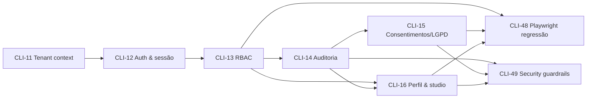
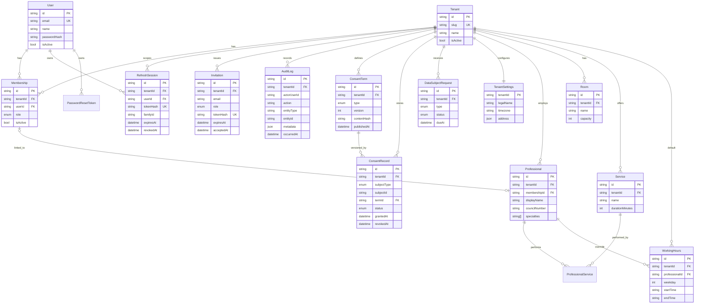

# Plano de implementação — Sprint 1 (Tenant & Auth)

**Feature pai:** [CLI-66 — Feature P0: Tenant, acesso e confiança](https://linear.app/clivyra/issue/CLI-66/feature-p0-tenant-acesso-e-confianca)
**Milestone:** Sprint 1 — Tenant & Auth
**Objetivo:** estabelecer a base segura para qualquer dado do piloto Studio Vega antes da primeira entidade de negócio (paciente, agenda, financeiro).

> Este documento é um **plano**. Nada aqui foi implementado. Cada card tem uma spec própria em
> [`docs/sprint-1/specs/`](./specs/) com modelo de dados, contratos de API, regras, testes e plano de execução.

---

## 1. Sequência e dependências

| Ordem | Card | Título | Prioridade | Status Linear | Spec |
| --- | --- | --- | --- | --- | --- |
| 1 | [CLI-11](https://linear.app/clivyra/issue/CLI-11) | Contexto de tenant e isolamento multi-tenant | Urgent | In Progress | [CLI-11](./specs/CLI-11-tenant-context.md) |
| 2 | [CLI-12](https://linear.app/clivyra/issue/CLI-12) | Autenticação e gerenciamento de sessão | Urgent | In Progress | [CLI-12](./specs/CLI-12-auth-session.md) |
| 3 | [CLI-13](https://linear.app/clivyra/issue/CLI-13) | RBAC e permissões por perfil profissional | Urgent | In Progress | [CLI-13](./specs/CLI-13-rbac.md) |
| 4 | [CLI-14](https://linear.app/clivyra/issue/CLI-14) | Auditoria de ações e trilha de alterações | High | In Progress | [CLI-14](./specs/CLI-14-audit-trail.md) |
| 5 | [CLI-15](https://linear.app/clivyra/issue/CLI-15) | Consentimentos e direitos LGPD | Urgent | Backlog | [CLI-15](./specs/CLI-15-consent-lgpd.md) |
| 6 | [CLI-16](https://linear.app/clivyra/issue/CLI-16) | Perfil do profissional e configuração inicial do studio | High | Backlog | [CLI-16](./specs/CLI-16-professional-profile-studio-setup.md) |

Gates da sprint (fora deste plano, mas dependentes dele): **CLI-48** (Playwright E2E) e **CLI-49** (Security guardrails).



### Por que essa ordem

1. **CLI-11** é pré-requisito de tudo: sem `TenantContext` resolvido da sessão nenhuma query tenant-owned pode existir.
2. **CLI-12** é quem popula o principal autenticado que o `TenantContextGuard` consome. Sem auth, o contexto de tenant é só uma abstração testável em unidade.
3. **CLI-13** transforma o `role` do `Membership` em permissões reutilizáveis e entrega gestão de usuários (convite, papel, desativação) que CLI-16 usa para vincular profissional a usuário.
4. **CLI-14** precisa de ator (CLI-12) e tenant (CLI-11), e do catálogo de permissões (CLI-13) para expor consulta de auditoria. É pré-requisito de CLI-15 (consentimento tem que ser auditável) e de CLI-16 (dados sensíveis do profissional/studio auditados).
5. **CLI-15** depende de auditoria e de RBAC; o sujeito de dados (paciente) ainda não existe, então o modelo usa referência polimórfica preparada para o card de cadastro de pacientes.
6. **CLI-16** fecha a sprint entregando o primeiro conjunto de dados de negócio (studio, profissional, sala, horários) sobre toda a base anterior.

CLI-15 e CLI-16 podem andar **em paralelo** depois de CLI-14 mergeado.

---

## 2. Estado atual do repositório

### 2.1 `master`

| Área | Estado |
| --- | --- |
| Monorepo, Next.js PWA, NestJS, Prisma | Bootstrap Sprint 0 mergeado (PR #2) |
| Schema Prisma | Apenas `SystemMetadata` |
| API | `GET /health`, `ValidationPipe` global (`whitelist` + `forbidNonWhitelisted`), Helmet, CORS |
| Web | Página técnica estática, sem rotas de produto, sem sessão |
| CI | `pr-check.yml` (lint, typecheck, `npm test`, audit) — sem job de integração com Postgres, sem E2E no gate ([plano da esteira](../ci/PIPELINE_IMPLEMENTATION_PLAN.md)) |
| Deploy | OCI dev/prod ligado ao gate |

### 2.2 Trabalho prévio em branches (não está na `master`)

Existe uma pilha empilhada de PRs que foi mergeada **entre si**, mas cuja base nunca chegou à `master`:

```text
feat/CLI-5-bootstrap-monorepo (mergeada em master via #2, antes da pilha)
  └─ feat/CLI-47-security-guardrails  ← #3 (pin do Prisma) — mergeada em CLI-5 DEPOIS do #2
       └─ feat/CLI-11-tenant-context   ← #5 mergeado em CLI-47
            └─ feat/CLI-12-auth-session ← #6 mergeado em CLI-11
                 └─ feat/CLI-13-rbac-permissions ← #7 mergeado em CLI-12
```

Commits relevantes: `2b86e38` (CLI-11), `b7a2d9c` (CLI-12), `69bb8ef` (CLI-13). O conteúdo (36 arquivos, ~1.600 linhas) inclui `Tenant`/`User`/`Membership`/`RefreshSession`/`PasswordResetToken`, guards `AuthAccessGuard` → `TenantContextGuard` → `RbacGuard`, `TenantPrismaService`, catálogo de permissões e docs.

**Avaliação desse código** (para decidir reaproveitar vs. refazer):

| Achado | Severidade | Card | Ação prevista na spec |
| --- | --- | --- | --- |
| `RegisterDto` aceita `role` e `tenantSlug` do cliente: qualquer pessoa cria conta `OWNER` em qualquer tenant ativo | **BLOCKER** | CLI-12 | Remover auto-registro em tenant existente; entrada só por *signup de studio* (cria tenant + OWNER) ou *convite* (CLI-13) |
| `RbacGuard`/`TenantContextGuard` só atuam via `@UseGuards` por rota: esquecer o decorator = rota aberta | **HIGH** | CLI-13 | Guards globais (`APP_GUARD`) com `@Public()` explícito; deny by default |
| Sem rate limiting efetivo em login/reset (`ThrottlerModule` registrado, `ThrottlerGuard` não aplicado) | **HIGH** | CLI-12 | `ThrottlerGuard` + limites por rota (`login`, `password-reset/request`, `refresh`) |
| Refresh rotation sem detecção de reuso (token revogado reutilizado não derruba a família) | MEDIUM | CLI-12 | `familyId` + revogação em cascata ao detectar reuso |
| Reset token retornado no body sempre que `NODE_ENV !== production` | MEDIUM | CLI-12 | Flag explícita `AUTH_EXPOSE_RESET_TOKEN` proibida em produção (assert no boot) |
| "Filtros obrigatórios no Prisma" implementado como helper opcional (`TenantPrismaService.where`) — nada impede query sem tenant | MEDIUM | CLI-11 | Prisma Client Extension que injeta/exige `tenantId` em modelos tenant-owned + script `check:standards` |
| Testes só unitários; isolamento entre tenants não é provado contra Postgres | MEDIUM | CLI-11 | Harness `test:integration` (CI Fase 3) com cenários cross-tenant |
| Sem UI web (login, recuperação, proteção de rotas) | MEDIUM | CLI-12 | Páginas + `middleware.ts` + BFF de cookies |
| Sem gestão de usuários (owner gerenciar usuários e papéis — critério de aceite) | MEDIUM | CLI-13 | Convites, troca de papel, desativação |
| Sem `requestId`/logger estruturado | LOW | CLI-11 | Middleware de correlação + logger JSON |
| PBKDF2-SHA512 210k iterações com pepper | OK | CLI-12 | Manter (OWASP-compliant); argon2id fica como decisão em aberto |
| Tokens de acesso HS256 assinados manualmente com `node:crypto` | OK | CLI-12 | Manter ou trocar por `jose`; sem impacto de contrato |

### 2.3 Decisão de estratégia

**Reaproveitar a pilha, endurecendo-a.** O desenho geral (User global + Membership por tenant, contexto resolvido do token e revalidado por request, permissões por papel com deny by default) está alinhado ao `AGENTS.md`. Refazer do zero custaria mais que corrigir os achados acima.

Operacionalmente:

1. Criar branches novas a partir de `master` (`feat/CLI-11-tenant-context`, etc. — reutilizar os nomes exige *force push*; preferir sufixo `-v2` ou apagar as antigas após acordo do time).
2. `git cherry-pick 2b86e38` (CLI-11) sobre `master`; aplicar a spec CLI-11; abrir PR **contra `master`**.
3. Repetir para `b7a2d9c` (CLI-12) e `69bb8ef` (CLI-13), cada um empilhado sobre o anterior, com PR base = branch anterior até o merge, depois retarget para `master`.
4. Fechar/arquivar os PRs #5, #6, #7 como superseded.

---

## 3. Fundações transversais (entram no PR do CLI-11)

Por ser o primeiro PR de domínio, CLI-11 carrega as fundações que os demais consomem. Não são "expansão de escopo": são pré-condições para os critérios de aceite "tenant ativo é propagado por request" e "testes automatizados cobrem vazamento horizontal".

| Fundação | Onde | Consumido por |
| --- | --- | --- |
| `RequestContext` (requestId, ip, userAgent) via `AsyncLocalStorage` | `apps/api/src/common/request-context/` | Auditoria (CLI-14), logs |
| Logger estruturado JSON com `requestId`/`tenantId`, redaction de chaves sensíveis | `apps/api/src/common/logging/` | Todos |
| `TenantContextStorage` (ALS) além de `request.tenantContext` | `apps/api/src/tenant/` | Prisma extension, serviços sem acesso ao request |
| Prisma Client Extension de tenant (`tenantScoped`) | `apps/api/src/prisma/` | Toda entidade tenant-owned |
| Registro `TENANT_OWNED_MODELS` | `apps/api/src/prisma/tenant-owned-models.ts` | Extension, `check:standards` |
| Harness de integração (`apps/api/test/integration/`, `test:integration`, Postgres no CI) | raiz + `.github/workflows` | CLI-11..16 |
| Contratos compartilhados (`Role`, `TenantContext`, `Permission`, DTOs públicos) | `packages/types/src/` | Web e API |
| `scripts/check-tenant-boundaries.mjs` (heurística: `tenantId` em DTO/controller/query params) | `scripts/` | CI `lint-and-standards` |

Dependência com a esteira: CI Fase 3 (`integration-tests` + service Postgres) precisa existir até o merge de CLI-11. Se o PR de CI não estiver pronto, o job entra no próprio PR do CLI-11.

---

## 4. Modelo de dados consolidado (visão da sprint)



Regras que valem para **todas** as tabelas novas:

- `tenantId` obrigatório com FK para `Tenant` em toda entidade tenant-owned (`User` é a única entidade global; `Membership` é o vínculo).
- Índices começam por `tenantId` (`@@index([tenantId, ...])`); uniques de negócio são compostos com `tenantId`.
- `onDelete` de `Tenant` → `Restrict` para dados regulatórios (`AuditLog`, `ConsentRecord`); `Cascade` só onde a perda é aceitável (sessões).
- Timestamps `createdAt`/`updatedAt`; soft-delete via `isActive`/`deletedAt` onde houver histórico obrigatório.
- Nenhuma migration destrutiva na sprint. Tabelas novas apenas; alterações em `Tenant`/`User` são aditivas e nullable.

---

## 5. Matriz de permissões alvo (consolidada)

Catálogo em `packages/types/src/rbac.ts`. Cada card só **adiciona** entradas.

| Permissão | OWNER | ADMIN | PROFESSIONAL | RECEPTION | Introduzida em |
| --- | :-: | :-: | :-: | :-: | --- |
| `agenda:read` / `agenda:write` | ✓ | ✓ | ✓ | ✓ | CLI-13 |
| `clients:read` / `clients:write` | ✓ | ✓ | ✓ | ✓ | CLI-13 |
| `finance:read` / `finance:write` | ✓ | ✓ | – | – | CLI-13 |
| `clinical-record:read` / `clinical-record:write` | ✓ | ✓ (decisão aberta, §9) | ✓ | – | CLI-13 |
| `settings:read` | ✓ | ✓ | ✓ | ✓ | CLI-13 |
| `settings:write` | ✓ | ✓ | – | – | CLI-13 |
| `tenant:manage` (dados legais/fiscais do studio, desativação) | ✓ | – | – | – | CLI-16 |
| `users:read` | ✓ | ✓ | – | – | CLI-13 |
| `users:write` (convidar, papel, desativar; ADMIN não concede OWNER) | ✓ | ✓ | – | – | CLI-13 |
| `audit:read` | ✓ | ✓ | – | – | CLI-14 |
| `consent:read` / `consent:write` | ✓ | ✓ | ✓ | ✓ | CLI-15 |
| `lgpd:manage` (requisições do titular, anonimização) | ✓ | ✓ | – | – | CLI-15 |
| `professionals:read` | ✓ | ✓ | ✓ | ✓ | CLI-16 |
| `professionals:write` | ✓ | ✓ | – | – | CLI-16 |
| `professionals:self` (editar o próprio perfil, campos limitados) | ✓ | ✓ | ✓ | – | CLI-16 |

Regras fixas: deny by default; rota sem `@Public()` e sem `@RequirePermissions()` falha com 403; `finance` e `clinical-record` nunca derivam um do outro; `OWNER` é o único papel que pode conceder `OWNER`; um tenant sempre mantém ≥ 1 `OWNER` ativo.

---

## 6. Contratos de API por card (índice)

| Card | Endpoints (prefixo `/api` não usado; API própria em `:3001`) |
| --- | --- |
| CLI-11 | Nenhum endpoint público novo. `GET /health` ganha `ready` com DB. Guards e extension internos |
| CLI-12 | `POST /auth/signup` (feature-flag), `POST /auth/login`, `POST /auth/refresh`, `POST /auth/logout`, `POST /auth/logout-all`, `POST /auth/switch-tenant`, `GET /auth/me`, `GET /auth/sessions`, `DELETE /auth/sessions/:id`, `POST /auth/password-reset/request`, `POST /auth/password-reset/confirm` |
| CLI-13 | `GET /users`, `POST /users/invitations`, `DELETE /users/invitations/:id`, `POST /auth/invitations/accept` (público), `PATCH /users/:membershipId/role`, `POST /users/:membershipId/deactivate`, `POST /users/:membershipId/activate`, `GET /auth/permissions` |
| CLI-14 | `GET /audit-logs`, `GET /audit-logs/:id` (somente leitura) |
| CLI-15 | `GET/POST /consent-terms`, `POST /consent-terms/:id/publish`, `GET/POST /consents`, `POST /consents/:id/revoke`, `GET /consents/status`, `GET/POST /lgpd/requests`, `PATCH /lgpd/requests/:id` |
| CLI-16 | `GET/PATCH /tenant/settings`, `GET/POST/PATCH /professionals`, `GET/PATCH /professionals/me`, `POST /professionals/:id/signature`, `GET/POST/PATCH /rooms`, `GET/POST/PATCH /services`, `GET/PUT /working-hours` |

Convenções comuns: erros no formato `{ statusCode, error, message, requestId }`; `404` para recurso de outro tenant (nunca `403`, para não confirmar existência); paginação por cursor (`?cursor&limit≤100`); DTOs `class-validator` com allowlist (`whitelist` + `forbidNonWhitelisted` já globais).

---

## 7. Frontend (apps/web) na sprint

| Card | Entrega web |
| --- | --- |
| CLI-11 | Nenhuma. Tipos compartilhados |
| CLI-12 | `/login`, `/recuperar-senha`, `/redefinir-senha/[token]`, shell autenticado `/app`, `middleware.ts`, BFF de sessão (`app/api/session/*`), troca de tenant |
| CLI-13 | Hook `usePermissions()`; ocultar navegação sem permissão (cosmético); tela `/app/configuracoes/usuarios` (lista, convite, papel, desativar) |
| CLI-14 | `/app/configuracoes/auditoria` (lista filtrável, somente leitura) |
| CLI-15 | `/app/configuracoes/termos` (versões), componente de coleta/revogação de consentimento reutilizável, `/app/configuracoes/lgpd` (requisições) |
| CLI-16 | Onboarding pós-signup (studio → perfil profissional → horários), `/app/configuracoes/studio`, `/app/configuracoes/profissionais`, salas e serviços |

Mobile-first, PWA. Toda proteção de rota web é UX; a autorização real é na API.

---

## 8. Estratégia de testes

| Nível | Ferramenta | Onde | Regra |
| --- | --- | --- | --- |
| Unit | Jest | `apps/api/src/**/*.spec.ts`, `packages/**` | Sem DB/rede. Guards, serviços puros, mapeadores de permissão, sanitizador de auditoria |
| Integration | Jest + Nest Testing + Postgres real | `apps/api/test/integration/*.integration.spec.ts` | Migrations aplicadas, dois tenants fixos (A/B), usuário por papel. Todo card adiciona pelo menos 1 cenário cross-tenant e 1 de 401/403 |
| E2E | Playwright (skill `domain-rules-playwright`, Given/When/Then) | `tests/e2e/` | Fluxos visíveis: login, recuperação, convite, onboarding, auditoria visível, consentimento. Fixtures sintéticas, sem PII real |
| Standards | `check:standards` | CI | `tenantId` em input de cliente, import de SDK LLM fora do gateway, `console.log` em `apps/api` |

Fixture padrão de integração (criada em CLI-11, ampliada depois): tenants `studio-a`, `studio-b`; usuários `owner@a`, `admin@a`, `pro@a`, `recep@a`, `owner@b`; senhas apenas via variável de teste.

---

## 9. Decisões em aberto (precisam de PO/tech lead antes do PR correspondente)

| # | Decisão | Card | Recomendação | Impacto se adiada |
| --- | --- | --- | --- | --- |
| D1 | Transporte do refresh token no web: cookie `httpOnly` (BFF Next) vs. body | CLI-12 | Cookie `httpOnly; Secure; SameSite=Lax; Path=/auth`, access token em memória | Sem decisão, a web não pode ser implementada |
| D2 | Auto-signup de studio aberto ao público no piloto | CLI-12 | `AUTH_SELF_SIGNUP_ENABLED=false` no piloto; Studio Vega via seed/convite | Nenhum; flag |
| D3 | Hash de senha: manter PBKDF2 ou adotar argon2id (dependência nativa) | CLI-12 | Manter PBKDF2-SHA512 210k; prefixo do hash permite migração | Nenhum |
| D4 | `ADMIN` acessa prontuário? (Linear agrupa "owner/admin") | CLI-13 | Manter acesso no P0 (studio pequeno: admin costuma ser fisio); revisar com LGPD antes de produção comercial | Matriz muda |
| D5 | Provedor de e-mail para recuperação de senha | CLI-12 | `MailerPort` com adapter SMTP (`nodemailer`) + `NoopMailer` em dev/test; provedor definido pela infra | Fluxo "ponta a ponta" só via flag de teste |
| D6 | Row-Level Security no Postgres como defesa em profundidade | CLI-11 | Fora do P0; extension Prisma + testes de integração são o gate. Registrar como follow-up | Nenhum |
| D7 | Retenção de auditoria e de consentimentos | CLI-14/15 | Sem purge no P0; documentar prazos (prontuário 20 anos CFM/COFFITO) e decidir com jurídico | Nenhum |
| D8 | Armazenamento da assinatura do profissional (object storage privado) | CLI-16 | `FileStoragePort` com adapter local em dev e OCI Object Storage em prod; upload como fase 2 do card | Assinatura vira metadado até existir storage |
| D9 | Catálogo `Service` mínimo entra em CLI-16 ou no card de Planos | CLI-16 | Entra em CLI-16 sem preço (nome, duração, ativo); preço/planos no card financeiro | Profissional sem vínculo a serviços |

---

## 10. Ordem de PRs e critérios de merge

| # | PR | Base | Conteúdo | Gate mínimo |
| --- | --- | --- | --- | --- |
| 1 | `docs: plano e specs Sprint 1` (este) | `master` | Docs | Review |
| 2 | `CLI-11 — Tenant context e isolamento` | `master` | Schema base, guards, ALS, extension, harness de integração, standards | lint, typecheck, unit, **integration cross-tenant**, security review |
| 3 | `CLI-12 — Autenticação e sessão` | PR 2 → `master` | Auth API + web login/recuperação | + E2E login/recuperação, rate limit provado |
| 4 | `CLI-13 — RBAC e gestão de usuários` | PR 3 → `master` | Guards globais, catálogo, convites | + matriz de 403 por papel, E2E convite |
| 5 | `CLI-14 — Auditoria` | `master` | AuditLog, interceptor, consulta | + prova de imutabilidade (trigger), sem segredo em metadata |
| 6a | `CLI-15 — Consentimentos/LGPD` | `master` | Termos, consentimentos, requisições do titular | + revogação preserva histórico, cross-tenant |
| 6b | `CLI-16 — Perfil e studio` | `master` | Settings, profissionais, salas, serviços, horários, onboarding | + RBAC em campos sensíveis, E2E onboarding |

Cada PR: título `CLI-XX — <título>`, branch `feat/CLI-XX-<slug>`, commits com ID Linear, checklist do `AGENTS.md` §20 no corpo, revisão por CI → Playwright → Security → Codex → CodeRabbit → humano.

---

## 11. Variáveis de ambiente novas (consolidado)

| Variável | Card | Obrigatória em prod | Default dev |
| --- | --- | --- | --- |
| `AUTH_ACCESS_TOKEN_SECRET` | CLI-12 | sim (≥ 32 bytes) | valor de dev explícito |
| `AUTH_PASSWORD_PEPPER` | CLI-12 | sim | valor de dev explícito |
| `AUTH_ACCESS_TOKEN_TTL_SECONDS` | CLI-12 | não | `900` |
| `AUTH_REFRESH_TOKEN_TTL_SECONDS` | CLI-12 | não | `604800` |
| `AUTH_PASSWORD_RESET_TTL_SECONDS` | CLI-12 | não | `1800` |
| `AUTH_SELF_SIGNUP_ENABLED` | CLI-12 | não | `false` |
| `AUTH_EXPOSE_RESET_TOKEN` | CLI-12 | **proibida** (boot falha se `true`) | `false` |
| `AUTH_COOKIE_DOMAIN`, `AUTH_COOKIE_SECURE` | CLI-12 | sim | `localhost`, `false` |
| `MAILER_DRIVER` (`noop` \| `smtp`), `SMTP_*` | CLI-12 | sim se `smtp` | `noop` |
| `INVITATION_TTL_HOURS` | CLI-13 | não | `72` |
| `AUDIT_IP_HASH_SALT` | CLI-14 | sim | valor de dev |
| `LGPD_REQUEST_SLA_DAYS` | CLI-15 | não | `15` |
| `FILE_STORAGE_DRIVER` (`local` \| `oci`), `FILE_STORAGE_*` | CLI-16 | sim | `local` |
| `SEED_*` (já existem na pilha) | CLI-11 | – | – |

Nenhum segredo com default utilizável em produção: o boot falha se `NODE_ENV=production` e o valor estiver ausente ou igual ao default de dev.

---

## 12. Riscos

| Risco | Mitigação |
| --- | --- |
| Pilha antiga divergir da `master` (lockfile, deps Nest 12 pendentes no Dependabot) | Cherry-pick por card; resolver conflitos de `package-lock.json` regenerando |
| CI sem job de integração no merge de CLI-11 | Incluir job no próprio PR se CI Fase 3 não estiver mergeada |
| Prisma extension quebrar queries de bootstrap (seed, health) | Modelos globais (`SystemMetadata`, `User`, `Tenant`) fora do registro; `bypassTenant()` explícito e logado para jobs |
| Cookies cross-origin web (`:3000`) ↔ API (`:3001`) em dev | BFF Next (`app/api/session/*`) faz proxy same-origin; em prod, mesmo domínio via reverse proxy OCI |
| Escopo de CLI-16 crescer para agenda/serviços/preço | Spec delimita: catálogo sem preço, sem agendamento, sem upload de assinatura se storage não estiver pronto |
| PII em fixtures e artefatos Playwright | Dados sintéticos; sem screenshot de telas com CREFITO/CPF reais; `.gitignore` de `test-results/` |
| Sujeito de consentimento (paciente) ainda não existe | `subjectType/subjectId` polimórfico; FK adicionada quando o card de pacientes chegar |

---

## 13. Definition of Done da sprint

- [ ] CLI-11..16 mergeados na `master` com PRs individuais
- [ ] Toda tabela tenant-owned tem `tenantId` + FK + índice iniciando por `tenantId`
- [ ] Nenhuma rota privada sem guard global; `check:standards` verde
- [ ] Testes de integração provam: cross-tenant 404, 401 sem token, 403 por papel, reuso de refresh revoga família, auditoria imutável, revogação de consentimento preserva histórico
- [ ] E2E Playwright: login, recuperação de senha, convite, onboarding do studio, consentimento
- [ ] Security review sem BLOCKER/HIGH em cada PR
- [ ] Docs: `docs/tenant-context.md`, `docs/auth-session.md`, `docs/rbac.md`, `docs/audit-trail.md`, `docs/consent-lgpd.md`, `docs/studio-setup.md`, `README.md` (env vars)
- [ ] CLI-48 e CLI-49 executados sobre o conjunto entregue

---

## Referências

- `AGENTS.md` — regras de multi-tenancy, segurança, LGPD, PR e Definition of Done
- [`docs/ci/PIPELINE_IMPLEMENTATION_PLAN.md`](../ci/PIPELINE_IMPLEMENTATION_PLAN.md) — job de integração, standards, E2E no gate
- [`docs/discovery-closure.md`](../discovery-closure.md) — escopo P0 aprovado
- `.cursor/skills/domain-rules-playwright/` — cenários Given/When/Then
- Branches de referência: `origin/feat/CLI-11-tenant-context`, `origin/feat/CLI-12-auth-session`, `origin/feat/CLI-13-rbac-permissions`
