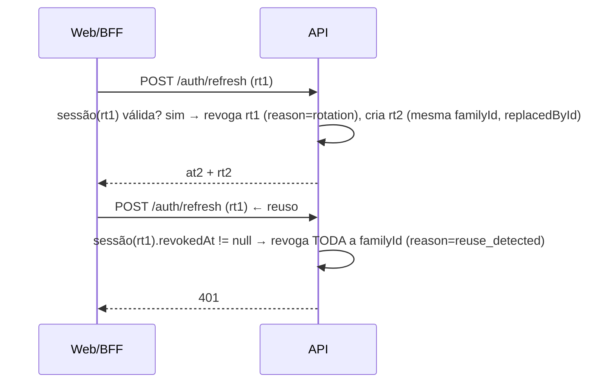

# Spec — CLI-12 Autenticação e gerenciamento de sessão

| Campo | Valor |
| --- | --- |
| Linear | [CLI-12](https://linear.app/clivyra/issue/CLI-12/sprint-1-autenticacao-e-gerenciamento-de-sessao) — Urgent — In Progress |
| Pai | CLI-66 |
| Branch | `feat/CLI-12-auth-session` (a partir de `feat/CLI-11-tenant-context`; cherry-pick de `b7a2d9c`) |
| Depende de | CLI-11 (Tenant/User/Membership, `TenantContextGuard`, harness de integração) |
| Bloqueia | CLI-13, CLI-14, CLI-15, CLI-16, CLI-48 |
| Decisões em aberto | D1 (cookie), D2 (self-signup), D3 (hash), D5 (e-mail) — ver plano §9 |

## 1. Objetivo

Autenticação segura para profissionais e administradores: senha com hash forte, access token curto + refresh token opaco revogável com rotação, logout, recuperação de senha ponta a ponta e proteção de rotas na API e na web.

## 2. Escopo

### Dentro

- Login por e-mail/senha com seleção de tenant (usuário pode ter várias memberships).
- Signup de studio (cria `Tenant` + `User` + `Membership OWNER` atomicamente) atrás de feature flag.
- Access token (JWT HS256, 15 min) e refresh token opaco (7 dias) com rotação, `familyId` e detecção de reuso.
- Logout (sessão atual), logout de todas as sessões, listagem/revogação de sessões.
- Troca de tenant ativo (`switch-tenant`) sem novo login.
- Recuperação de senha: solicitação (resposta genérica), e-mail via `MailerPort`, confirmação com token de uso único, revogação de sessões.
- Rate limiting por rota e bloqueio progressivo por conta.
- Web: páginas de login, recuperação e redefinição; shell autenticado; `middleware.ts`; BFF de sessão com cookies `httpOnly`.
- `AuthGuard` global com `@Public()` (a ordem completa de guards globais é fechada em CLI-13, mas o `AuthGuard` já entra global aqui).

### Fora

- Aceite de convite (`/auth/invitations/accept`) — CLI-13.
- MFA, login social, SSO, verificação de e-mail obrigatória (pós-piloto; `emailVerifiedAt` já previsto).
- Permissões por papel — CLI-13.

## 3. Critérios de aceite → verificação

| Critério | Prova |
| --- | --- |
| Rotas privadas exigem autenticação | `AuthGuard` global; integração: toda rota não `@Public()` → `401` sem token, com token expirado, com assinatura inválida; web: `middleware.ts` redireciona para `/login` |
| Refresh token pode ser revogado | `POST /auth/logout` → refresh anterior retorna `401`; `DELETE /auth/sessions/:id`; reuso de token rotacionado revoga a família inteira |
| Senha nunca é armazenada em texto puro | `passwordHash` no formato `pbkdf2$<iter>$<salt>$<hash>`; teste garante que `User` nunca tem coluna/log com a senha; DTOs de resposta nunca incluem `passwordHash` |
| Fluxo de recuperação funciona ponta a ponta | E2E: solicitar → obter token (mailbox de teste) → redefinir → login com nova senha → sessões antigas revogadas |

## 4. Estado atual e gaps

Referência: commit `b7a2d9c` (`AuthService`, `AuthTokenService`, `PasswordHasherService`, `AuthAccessGuard`, DTOs, `RefreshSession`, `PasswordResetToken`, `docs/auth-session.md`).

| Gap | Severidade | Ação |
| --- | --- | --- |
| `POST /auth/register` aceita `tenantSlug` + `role` → conta OWNER em tenant alheio | **BLOCKER** | Remover. Substituir por `POST /auth/signup` (novo tenant) sob flag; entrada em tenant existente só via convite (CLI-13) |
| `ThrottlerGuard` não aplicado | **HIGH** | Guard global + `@Throttle` por rota |
| Rotação sem detecção de reuso | MEDIUM | `familyId`, `replacedById`; reuso → revoga família + audit (CLI-14) |
| Reset token no body em não-produção | MEDIUM | `AUTH_EXPOSE_RESET_TOKEN` explícita, proibida em prod; preferir mailbox de teste |
| Sem lockout por conta | MEDIUM | `failedLoginCount`/`lockedUntil` |
| Login sem `tenantSlug` escolhe a primeira membership | LOW | Se > 1 membership: responder `409 TENANT_SELECTION_REQUIRED` com lista `{ tenantId, slug, name }`; `switch-tenant` depois |
| Sem web | MEDIUM | §6.6 |
| Sem e-mail | MEDIUM | `MailerPort` |

## 5. Modelo de dados

```prisma
model User {
  // ... CLI-11
  passwordHash     String?
  passwordChangedAt DateTime?
  emailVerifiedAt  DateTime?
  lastLoginAt      DateTime?
  failedLoginCount Int       @default(0)
  lockedUntil      DateTime?
  sessions         RefreshSession[]
  resetTokens      PasswordResetToken[]
}

model Tenant {
  // ... CLI-11
  sessions RefreshSession[]
}

model RefreshSession {
  id             String    @id @default(cuid())
  tenantId       String
  userId         String
  familyId       String                  // mesma família ao longo das rotações
  tokenHash      String    @unique       // HMAC-SHA256(token, secret)
  replacedById   String?   @unique       // sessão que substituiu esta na rotação
  expiresAt      DateTime
  revokedAt      DateTime?
  revokedReason  String?                 // logout | rotation | reuse_detected | password_reset | admin | switch_tenant
  lastUsedAt     DateTime?
  userAgent      String?                 // truncado 256
  ipHash         String?                 // sha256(ip + AUDIT_IP_HASH_SALT)
  createdAt      DateTime  @default(now())
  updatedAt      DateTime  @updatedAt
  tenant         Tenant    @relation(fields: [tenantId], references: [id], onDelete: Cascade)
  user           User      @relation(fields: [userId], references: [id], onDelete: Cascade)

  @@index([tenantId, userId, revokedAt])
  @@index([userId, familyId])
  @@index([expiresAt])
}

model PasswordResetToken {
  id        String    @id @default(cuid())
  userId    String
  tokenHash String    @unique
  expiresAt DateTime
  usedAt    DateTime?
  createdAt DateTime  @default(now())
  user      User      @relation(fields: [userId], references: [id], onDelete: Cascade)

  @@index([userId, usedAt])
  @@index([expiresAt])
}
```

`RefreshSession` entra em `TENANT_OWNED_MODELS`; `PasswordResetToken` é global (pertence ao `User`). Migration aditiva.

## 6. Design

### 6.1 Módulos e arquivos

```text
apps/api/src/auth/
  auth.module.ts
  auth.controller.ts
  auth.service.ts                 # orquestra casos de uso (login, signup, refresh, logout, switch, sessions)
  password-reset.service.ts       # separado para manter AuthService pequeno
  auth-token.service.ts           # access JWT + opaque tokens + hashing
  password-hasher.service.ts      # PBKDF2-SHA512 + pepper (prefixo permite migração p/ argon2id)
  auth.guard.ts                   # global; respeita @Public()
  public.decorator.ts
  current-user.decorator.ts
  auth-throttle.config.ts         # limites por rota
  account-lockout.policy.ts       # regra pura (contagem/janela/duração)
  dto/ (signup.dto.ts, login.dto.ts, refresh.dto.ts, switch-tenant.dto.ts, password-reset.dto.ts)
  auth.types.ts                   # re-export @clivyra/types/auth
apps/api/src/mailer/
  mailer.module.ts, mailer.port.ts, noop.mailer.ts, smtp.mailer.ts, test-mailbox.mailer.ts
  templates/password-reset.ts     # texto simples pt-BR, sem dados além do link
packages/types/src/auth.ts        # AuthSessionResponse, MeResponse, TenantSelectionRequired, códigos de erro
apps/web/
  middleware.ts
  app/(public)/login/page.tsx
  app/(public)/recuperar-senha/page.tsx
  app/(public)/redefinir-senha/[token]/page.tsx
  app/(app)/layout.tsx             # shell autenticado
  app/(app)/app/page.tsx           # placeholder pós-login
  app/api/session/login/route.ts   # BFF
  app/api/session/refresh/route.ts
  app/api/session/logout/route.ts
  app/api/session/switch-tenant/route.ts
  lib/session/ (server: getSession(), apiFetch(); client: SessionProvider, useSession())
```

### 6.2 Tokens

**Access token** (JWT HS256, `AUTH_ACCESS_TOKEN_SECRET` ≥ 32 bytes):

```json
{ "sub": "<userId>", "tid": "<tenantId>", "sid": "<refreshSessionId>", "typ": "access", "iat": 0, "exp": 0, "jti": "<uuid>" }
```

- TTL 15 min. Não carrega `role` nem permissões: `TenantContextGuard` revalida membership a cada request, o que permite revogar acesso imediatamente ao desativar um usuário.
- `AuthGuard` valida assinatura/exp e ainda checa que `sid` aponta para sessão não revogada? **Não** a cada request (custo); revogação efetiva ≤ TTL do access token. Exceção: `logout-all`, desativação e reset de senha gravam `User.passwordChangedAt`/`sessionsInvalidatedAt` e o guard compara `iat` com esse carimbo (uma leitura de `User` já feita pelo `TenantContextGuard`), tornando a revogação imediata sem consulta extra.

**Refresh token**: 32 bytes `base64url`, opaco. Persistido só o HMAC. Entregue:

- Web: cookie `clivyra_rt` `HttpOnly; Secure; SameSite=Lax; Path=/api/session` no domínio da web, gravado pelo BFF (D1). O browser nunca vê o refresh token em JS.
- Clientes não-browser/testes: no body da resposta, apenas quando o request traz `X-Client: api` (default nos testes de integração). O BFF sempre chama a API com `X-Client: api` e transforma em cookie.

**Rotação e reuso**:



### 6.3 Endpoints

Todos sob `/auth`. Público = `@Public()`. Throttle em `X-Forwarded-For` confiável (`trust proxy`) + chave secundária (e-mail normalizado) onde indicado.

| Método/rota | Auth | Throttle | Request | Resposta |
| --- | --- | --- | --- | --- |
| `POST /auth/signup` | público; `AUTH_SELF_SIGNUP_ENABLED` | 3/h por IP | `{ studioName, slug, ownerName, email, password }` | `201 AuthSessionResponse` |
| `POST /auth/login` | público | 5/min por IP+e-mail, 20/min por IP | `{ email, password, tenantSlug? }` | `200 AuthSessionResponse` \| `409 { code: 'TENANT_SELECTION_REQUIRED', tenants: [...] }` |
| `POST /auth/refresh` | público (token no cookie/body) | 30/min por IP | `{ refreshToken? }` | `200 AuthSessionResponse` |
| `POST /auth/logout` | público (idempotente) | 30/min | `{ refreshToken? }` | `204` |
| `POST /auth/logout-all` | autenticado | 10/min | – | `204` (revoga todas as sessões do usuário em todos os tenants) |
| `POST /auth/switch-tenant` | autenticado | 10/min | `{ tenantId }` | `200 AuthSessionResponse` (nova sessão no tenant alvo; sessão anterior revogada `reason=switch_tenant`) |
| `GET /auth/me` | autenticado | – | – | `{ user: { id, name, email }, tenant: { id, slug, name }, membership: { id, role }, memberships: [{ tenantId, slug, name, role }] }` |
| `GET /auth/sessions` | autenticado | – | – | `[{ id, createdAt, lastUsedAt, userAgent, current }]` — sem IP em claro |
| `DELETE /auth/sessions/:id` | autenticado | – | – | `204` (só sessões do próprio usuário; id alheio → `404`) |
| `POST /auth/password-reset/request` | público | 3/15 min por IP+e-mail | `{ email }` | `202 { status: 'ok' }` sempre |
| `POST /auth/password-reset/confirm` | público | 5/15 min por IP | `{ token, password }` | `204` |

`AuthSessionResponse`:

```ts
interface AuthSessionResponse {
  accessToken: string
  accessTokenExpiresAt: string   // ISO
  refreshToken?: string          // só X-Client: api
  user: { id: string; name: string; email: string }
  tenant: { id: string; slug: string; name: string }
  membership: { id: string; role: Role }
}
```

Regras de DTO: `email` `IsEmail` + normalização; `password` mín. 12, máx. 128, com pelo menos 3 classes de caracteres, rejeitar as 1.000 senhas mais comuns (lista embutida) e a que contenha o e-mail; `slug` regra de CLI-11; nenhum DTO aceita `role` ou `tenantId` como autorização.

### 6.4 Casos de uso (regras)

**Login**

1. Normaliza e-mail; busca `User` com memberships ativas em tenants ativos.
2. Se usuário inexistente, inativo ou sem `passwordHash`: ainda executa `hasher.verify` contra um hash dummy (tempo constante) e responde `401 Invalid credentials`.
3. Se `lockedUntil > now`: `423 ACCOUNT_LOCKED` (mensagem genérica sem prazo exato).
4. Senha inválida: incrementa `failedLoginCount`; ao atingir 10 em 15 min → `lockedUntil = now + 15 min` (dobra a cada bloqueio subsequente, máx. 24 h); responde `401`.
5. Senha válida: zera contador; se `tenantSlug` informado, exige membership nele; senão, se 1 membership usa-a; se > 1 → `409 TENANT_SELECTION_REQUIRED`.
6. Cria `RefreshSession` (nova `familyId`), assina access token, grava `lastLoginAt`.

**Signup de studio** (flag): transação única: cria `Tenant` (slug único, reservado), `User` (e-mail único; se já existir usuário → `409 EMAIL_IN_USE`, sem detalhar), `Membership OWNER`, `TenantSettings` vazio (CLI-16 pode preencher). Responde sessão. No piloto a flag fica desligada; Studio Vega nasce via seed.

**Refresh**: descrito em 6.2. Sessão expirada → `401`. Usuário/tenant/membership inativos → `401` e revoga sessão.

**Logout**: revoga a sessão do refresh apresentado (idempotente). BFF limpa cookie.

**Switch tenant**: exige membership ativa no `tenantId` alvo; cria nova sessão na outra tenant; revoga a atual. Access token novo carrega o `tid` novo. Não é possível "ter dois tenants ativos" na mesma sessão.

**Password reset — request**: sempre `202`. Se usuário ativo: cria `PasswordResetToken` (invalida os anteriores não usados), envia e-mail via `MailerPort` com link `${WEB_ORIGIN}/redefinir-senha/${token}`. O token nunca é logado. Em `NODE_ENV=test`, `TestMailboxMailer` guarda em memória e expõe `GET /__test__/mailbox?to=` (só em teste). `AUTH_EXPOSE_RESET_TOKEN=true` devolve o token no body **apenas** em `development`; boot falha se `true` em produção.

**Password reset — confirm**: token válido, não usado, não expirado; transação: atualiza `passwordHash`, `passwordChangedAt`, marca `usedAt`, revoga todas as `RefreshSession` do usuário (`reason=password_reset`), zera lockout. Envia e-mail de aviso "sua senha foi alterada".

### 6.5 Guards e ordem

- `AuthGuard` registrado como `APP_GUARD` (primeiro). Rota `@Public()` pula. Extrai `Bearer` do header `Authorization`; nunca de query string.
- `TenantContextGuard` (CLI-11) continua por rota neste card e vira global em CLI-13 junto com `RbacGuard`.
- `ThrottlerGuard` global antes de tudo; limites default `100/min`, overrides por rota.

### 6.6 Web (Next.js)

- **BFF** em `app/api/session/*`: recebe credenciais do form, chama a API com `X-Client: api`, grava cookies `clivyra_at` (access, `HttpOnly`, `Max-Age` = TTL) e `clivyra_rt` (refresh, `Path=/api/session`). Componentes server usam `apiFetch()` que lê `clivyra_at` do cookie e, se expirado, chama `/api/session/refresh` antes.
- **`middleware.ts`**: sem `clivyra_at` e sem `clivyra_rt` → redireciona `/app/*` para `/login?next=`. Com apenas `rt` → deixa passar e o layout força refresh. Proteção é UX; a API é a autoridade.
- **Páginas** (mobile-first, `pt-BR`): `/login` (e-mail, senha, "esqueci minha senha", seletor de studio quando `409`), `/recuperar-senha`, `/redefinir-senha/[token]` (força de senha, confirmação), `/app` (shell com nome do studio, menu vazio até CLI-13/16, botão sair, troca de studio quando há > 1 membership).
- Sem `localStorage` para tokens. Sem SW cacheando respostas autenticadas (`sw.js` deve excluir `/api/` e `/app/`).
- Acessibilidade básica: labels, `aria-live` em erros, foco no primeiro erro.

### 6.7 Configuração

Ver plano §11. Validação no boot (`packages/config` ganha `requireEnv(name, { production: true })`): secrets obrigatórios em produção e diferentes dos defaults de dev; `AUTH_EXPOSE_RESET_TOKEN` proibida em produção; `AUTH_COOKIE_SECURE=true` obrigatório em produção.

## 7. Segurança e LGPD

| Ameaça | Controle |
| --- | --- |
| Privilege escalation via registro | Sem registro em tenant existente; papel nunca vem do cliente |
| Credential stuffing / brute force | Throttle por IP+e-mail, lockout progressivo, tempo constante em falha |
| Enumeração de usuários | Mesma resposta/tempo para e-mail inexistente em login e reset |
| Roubo de refresh token | Opaco, hash no banco, rotação, detecção de reuso revoga família, cookie `HttpOnly`/`Secure` |
| XSS lendo tokens | Nenhum token em JS/localStorage no web |
| CSRF no BFF | `SameSite=Lax` + verificação de `Origin` nas rotas `app/api/session/*` (mutação) |
| Token em URL/log | Só header `Authorization`; redaction do logger; link de reset só no e-mail |
| Sessão persistir após desativação/reset | `TenantContextGuard` revalida membership; `passwordChangedAt` vs `iat` |
| Segredos default em prod | Boot falha |
| PII em e-mail | Template contém apenas nome e link; sem tenant/dados clínicos |
| Logs | Nunca logar senha, tokens, cookies; eventos `auth.login.failed` só com `userId` (se conhecido) e `ipHash` |

Auditoria dos eventos (`auth.login.succeeded`, `auth.logout`, `auth.session.revoked`, `auth.password.reset_requested`, `auth.password.changed`, `auth.refresh.reuse_detected`) é emitida via logger estruturado neste card e passa a persistir em `AuditLog` quando CLI-14 entrar (o `AuthService` chama uma interface `AuthEventsPort` que CLI-14 implementa).

## 8. Observabilidade

- Contadores via log: `auth.login.{succeeded,failed,locked}`, `auth.refresh.{rotated,reuse_detected,expired}`, `auth.reset.{requested,confirmed}`, `throttle.blocked{route}`.
- `requestId` em todas as respostas de erro de auth.

## 9. Testes

### Unit

- `PasswordHasherService`: hash ≠ senha; verify true/false; formato com prefixo; iterações mínimas; pepper diferente falha.
- `AuthTokenService`: assinatura, expiração, `typ`, rejeição de token adulterado e de `alg: none`.
- `AccountLockoutPolicy`: janelas, backoff, reset.
- `AuthService.login`: usuário inexistente → 401 e `verify` chamado (tempo constante); múltiplas memberships → 409; `tenantSlug` inexistente → 401.
- `AuthService.refresh`: rotação, reuso revoga família, expirado, membership inativa.
- `PasswordResetService`: token único, invalida anteriores, confirm revoga sessões, token usado duas vezes → 401.
- DTOs: senha fraca rejeitada; `role`/`tenantId` no body → `400` (`forbidNonWhitelisted`).
- Config: boot falha com segredo default em produção; `AUTH_EXPOSE_RESET_TOKEN=true` em produção falha.

### Integração (`auth.integration.spec.ts`, `auth-protection.integration.spec.ts`)

| Cenário | Esperado |
| --- | --- |
| Login `owner@a` | 200, `tenant.slug = studio-a`, cookie ausente (X-Client api → body) |
| Login senha errada ×10 | 401 ×9 depois 423 |
| Login usuário com 2 memberships sem slug | 409 com lista |
| `switch-tenant` para tenant sem membership | 403/404 sem detalhe; sessão atual mantida |
| Refresh rotaciona; reuso do anterior | 200 depois 401; todas as sessões da família revogadas |
| Logout depois refresh | 401 |
| `logout-all` | outras sessões 401 no próximo refresh; access antigo rejeitado (iat < passwordChangedAt/sessionsInvalidatedAt) |
| Toda rota do app sem token | 401 (iteração sobre o router do Nest, exceto `@Public()`) |
| Token assinado com outro segredo / expirado / `alg: none` | 401 |
| Reset request e-mail inexistente vs existente | mesma resposta 202; tempo dentro da mesma faixa |
| Reset confirm | senha nova loga; antiga não; sessões anteriores 401 |
| Usuário desativado após login | próxima request 401 |
| `POST /auth/signup` com flag off | 404; com flag on cria tenant+owner; slug reservado → 400; e-mail existente → 409 |

### E2E (Playwright, Given/When/Then — skill `domain-rules-playwright`)

```gherkin
Funcionalidade: Login e sessão
  Cenário: login com sucesso
    Dado um usuário OWNER do studio "studio-a"
    Quando ele acessa /login e informa e-mail e senha válidos
    Então é redirecionado para /app e vê o nome do studio

  Cenário: rota protegida sem sessão
    Quando um visitante acessa /app
    Então é redirecionado para /login?next=/app

  Cenário: sair
    Dado um usuário autenticado
    Quando clica em "Sair"
    Então volta para /login e /app redireciona novamente

Funcionalidade: Recuperação de senha
  Cenário: fluxo completo
    Dado um usuário existente
    Quando solicita recuperação em /recuperar-senha
    E abre o link recebido na mailbox de teste
    E define uma nova senha válida
    Então consegue entrar com a nova senha
    E a sessão anterior deixa de funcionar

  Cenário: e-mail inexistente
    Quando solicita recuperação para um e-mail desconhecido
    Então vê a mesma mensagem genérica de confirmação
```

Artefatos: sem screenshots contendo e-mail real; fixtures `*@studio-a.test`.

## 10. Plano de execução

1. [ ] Branch a partir de CLI-11; `git cherry-pick b7a2d9c`; remover `register` e `RegisterDto.role`.
2. [ ] Schema §5 + migration; `RefreshSession` no registro tenant-owned.
3. [ ] `packages/types/src/auth.ts`; `packages/config` `requireEnv`.
4. [ ] `AuthGuard` global + `@Public()`; anotar `/health*`, `/auth/*` públicos.
5. [ ] `ThrottlerGuard` global + `auth-throttle.config.ts`; `trust proxy` em `main.ts`.
6. [ ] `AccountLockoutPolicy`; login com tempo constante e seleção de tenant (409).
7. [ ] Refresh com `familyId`/`replacedById`/reuso; `logout-all`; `sessions`; `switch-tenant`; `me`.
8. [ ] `MailerModule` (`noop`, `smtp`, `test-mailbox`); `PasswordResetService`; rota `__test__/mailbox` só em teste.
9. [ ] `signup` sob flag + seed do Studio Vega (`SEED_*`, hash via variável).
10. [ ] `AuthEventsPort` (log estruturado) com os eventos da §7.
11. [ ] Web: BFF, `middleware.ts`, páginas, `SessionProvider`, exclusões no `sw.js`.
12. [ ] Testes §9; E2E com `webServer` do Playwright subindo API+web e Postgres de teste.
13. [ ] Docs: `docs/auth-session.md` (reescrever), `README.md`, `.env.example`, `infra/oci/env.*.example`.
14. [ ] `npm run lint && npm run typecheck && npm test && npm run test:integration && npm run test:e2e`.
15. [ ] PR `CLI-12 — Autenticação e gerenciamento de sessão` (base CLI-11 até merge; depois `master`).

## 11. Definition of Done

- [ ] Critérios da §3 provados em CI (unit + integração + E2E).
- [ ] Nenhuma rota privada acessível sem token (teste iterando o router).
- [ ] Reuso de refresh revoga família; lockout e throttle demonstrados.
- [ ] Nenhum token/senha em logs, respostas de erro, cookies legíveis por JS ou artefatos de teste.
- [ ] Segredos validados no boot; `.env.example` sem valores de produção.
- [ ] Security review sem BLOCKER/HIGH; D1/D2/D5 registradas como decididas no PR.

## 12. Riscos e decisões

| Item | Nota |
| --- | --- |
| D1 cookie vs body | Recomendação: BFF + cookies. Se o time preferir API setando cookies direto, exigir mesmo domínio em prod e `credentials: include` |
| D3 argon2id | PBKDF2 atende OWASP (≥ 210k SHA-512). Prefixo `pbkdf2$` permite migrar por rehash no login |
| D5 e-mail | Sem provedor definido: `noop` em dev, mailbox em teste, `smtp` em prod via secrets de infra |
| Access token 15 min vs revogação imediata | `passwordChangedAt`/`sessionsInvalidatedAt` comparado ao `iat` no guard cobre os casos críticos |
| Throttler atrás do proxy OCI | `trust proxy` configurado; teste de integração com `X-Forwarded-For` |
| E2E precisa de API + DB | Playwright `webServer` com `docker compose up db`; documentar no `README.md` |
