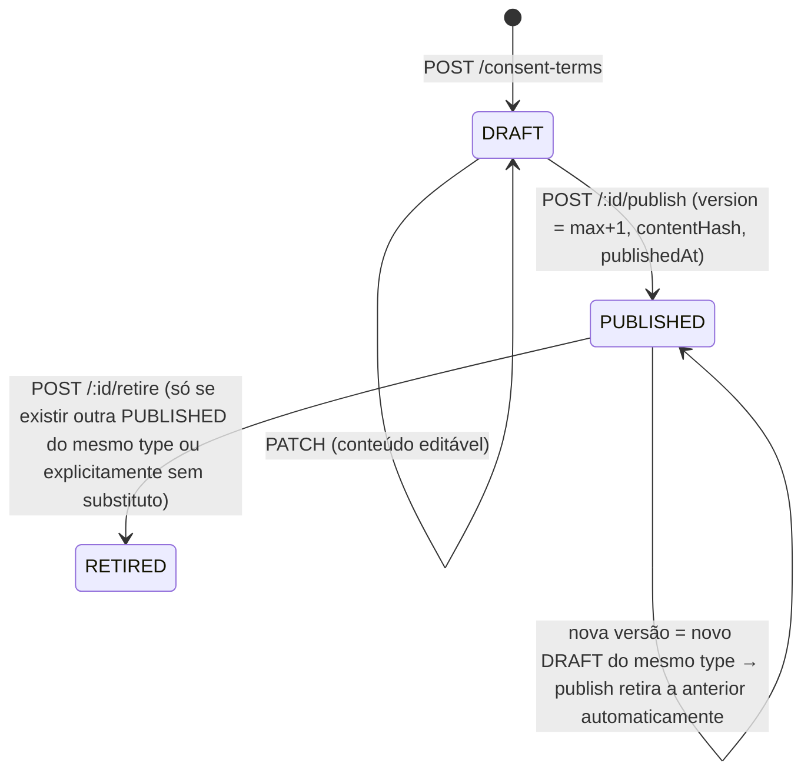

# Spec — CLI-15 Consentimentos e direitos LGPD

| Campo | Valor |
| --- | --- |
| Linear | [CLI-15](https://linear.app/clivyra/issue/CLI-15/sprint-1-consentimentos-e-direitos-lgpd) — Urgent — Backlog |
| Pai | CLI-66 |
| Branch | `feat/CLI-15-consent-lgpd` (a partir de `master` após merge de CLI-14) |
| Depende de | CLI-11, CLI-12, CLI-13 (`consent:*`, `lgpd:manage`), CLI-14 (auditoria obrigatória) |
| Bloqueia | CLI-48, CLI-49; cadastro de pacientes consome esta base |
| Decisões em aberto | D7 (retenção) |

## 1. Objetivo

Criar a base de gestão de consentimento e de direitos do titular: termos versionados por tenant, registro imutável de aceite/revogação com finalidade, base legal, origem e evidência, e APIs preparadas para exportação e anonimização/exclusão conforme regras de retenção — tudo isolado por tenant e auditado.

## 2. Escopo

### Dentro

- `ConsentTerm` versionado por tenant e tipo (política de privacidade, termo de tratamento, uso de imagem, comunicações).
- `ConsentRecord` append-only por sujeito (paciente, lead, usuário) com `status`, `grantedAt/revokedAt`, `source`, evidência mínima, finalidade e base legal.
- Estado corrente de consentimento por sujeito (`GET /consents/status`) e regra de "consentimento vigente" (termo ativo + versão aceita ≥ versão mínima exigida).
- `DataSubjectRequest` (acesso, portabilidade/exportação, retificação, exclusão/anonimização, revogação) com SLA e trilha.
- Portas `DataExporterPort` e `DataAnonymizerPort` com registro por módulo: cada módulo de domínio futuro registra como exporta e como anonimiza os dados de um sujeito. Neste card: implementações para `User`/`Membership` (usuário do sistema) e contrato para pacientes.
- Política de retenção declarativa (`RetentionPolicy` por categoria de dado) usada pelas requisições de exclusão para decidir entre apagar, anonimizar ou reter com justificativa legal.
- Auditoria de toda operação (CLI-14).
- Web: gestão de termos, componente de coleta/revogação, painel de requisições LGPD.

### Fora

- Entidade `Patient` (card de cadastro de pacientes): aqui o sujeito é polimórfico (`subjectType/subjectId`).
- Execução automática de exclusão/anonimização de dados clínicos (só o contrato e o fluxo de requisição; a execução real entra com cada módulo).
- Assinatura eletrônica com certificado ICP-Brasil; portal do titular self-service (pós-piloto).
- Geração de PDF do termo (texto/markdown com hash é suficiente no P0).

## 3. Critérios de aceite → verificação

| Critério | Prova |
| --- | --- |
| Consentimentos são versionados e auditáveis | `ConsentTerm.version` incremental por `(tenantId, type)`; `ConsentRecord` referencia `termId` + `termVersion` + `contentHash`; todo `grant/revoke` gera `AuditLog` (`consent.granted`/`consent.revoked`); integração verifica |
| Revogação não apaga histórico obrigatório | Revogar cria novo `ConsentRecord` `REVOKED` ligado ao anterior (`supersedesId`); registros são imutáveis (trigger igual ao de auditoria); teste tenta `DELETE`/`UPDATE` e falha |
| APIs ficam preparadas para exportação e anonimização | `POST /lgpd/requests` (`EXPORT`, `ERASURE`, `ACCESS`, `RECTIFICATION`) + `DataExporterPort`/`DataAnonymizerPort` com registry; teste de contrato exige que módulos marcados como "possui dados de titular" registrem exporter/anonymizer (`check:standards`) |
| Consentimentos são isolados por tenant | Modelos em `TENANT_OWNED_MODELS`; cross-tenant → 404/vazio em integração |

## 4. Modelo de dados

```prisma
enum ConsentTermType {
  PRIVACY_POLICY        // política de privacidade do studio para clientes
  DATA_PROCESSING       // termo de tratamento de dados de saúde (art. 11 LGPD)
  TREATMENT             // consentimento para atendimento/procedimento
  IMAGE_USE             // uso de imagem
  COMMUNICATIONS        // contato por WhatsApp/e-mail (marketing/lembretes)
}

enum ConsentTermStatus {
  DRAFT
  PUBLISHED
  RETIRED
}

enum ConsentSubjectType {
  PATIENT
  LEAD
  USER
}

enum ConsentStatus {
  GRANTED
  REVOKED
  EXPIRED
}

enum ConsentSource {
  WEB_FORM      // titular no próprio dispositivo (link/QR ou tablet do studio)
  IN_PERSON     // coletado presencialmente por um profissional (papel/verbal registrado)
  IMPORT        // migração de sistema anterior
  API
}

enum LegalBasis {
  CONSENT                 // art. 7 I / art. 11 I
  CONTRACT                // art. 7 V
  LEGAL_OBLIGATION        // art. 7 II / art. 11 II a
  HEALTH_PROTECTION       // art. 11 II f (tutela da saúde)
  LEGITIMATE_INTEREST     // art. 7 IX
}

model ConsentTerm {
  id           String            @id @default(cuid())
  tenantId     String
  type         ConsentTermType
  version      Int
  title        String
  content      String            // markdown/texto; imutável após PUBLISHED
  contentHash  String            // sha256(content) — evidência de qual texto foi aceito
  purposes     String[]          // finalidades declaradas (ex.: "agendamento", "prontuario")
  legalBasis   LegalBasis        @default(CONSENT)
  requiresRenewalAfterDays Int?  // null = sem expiração
  status       ConsentTermStatus @default(DRAFT)
  publishedAt  DateTime?
  retiredAt    DateTime?
  createdByUserId String
  createdAt    DateTime          @default(now())
  updatedAt    DateTime          @updatedAt
  tenant       Tenant            @relation(fields: [tenantId], references: [id], onDelete: Restrict)
  records      ConsentRecord[]

  @@unique([tenantId, type, version])
  @@index([tenantId, type, status])
}

/// Append-only. Estado atual = registro mais recente por (tenantId, subjectType, subjectId, term.type).
model ConsentRecord {
  id             String             @id @default(cuid())
  tenantId       String
  subjectType    ConsentSubjectType
  subjectId      String             // FK lógica; FK física para Patient adicionada no card de pacientes
  termId         String
  termVersion    Int                // desnormalizado para consulta sem join
  status         ConsentStatus
  source         ConsentSource
  grantedAt      DateTime?
  revokedAt      DateTime?
  expiresAt      DateTime?          // grantedAt + requiresRenewalAfterDays
  supersedesId   String?            @unique  // registro anterior que este substitui (revogação/renovação)
  collectedByUserId String?         // profissional que registrou (IN_PERSON/IMPORT)
  evidence       Json?              // { ipHash, userAgent, channel, signerName?, witnessUserId? } — sem IP em claro
  notes          String?            // máx. 500; sem dado clínico
  createdAt      DateTime           @default(now())
  tenant         Tenant             @relation(fields: [tenantId], references: [id], onDelete: Restrict)
  term           ConsentTerm        @relation(fields: [termId], references: [id], onDelete: Restrict)

  @@index([tenantId, subjectType, subjectId, createdAt(sort: Desc)])
  @@index([tenantId, termId, status])
  @@index([tenantId, status, expiresAt])
}

enum DataSubjectRequestType {
  ACCESS          // confirmação/acesso (art. 18 I, II)
  EXPORT          // portabilidade (art. 18 V)
  RECTIFICATION   // correção (art. 18 III)
  ERASURE         // eliminação/anonimização (art. 18 IV, VI)
  CONSENT_REVOCATION // art. 18 IX (atalho que também gera ConsentRecord REVOKED)
}

enum DataSubjectRequestStatus {
  RECEIVED
  IN_PROGRESS
  COMPLETED
  REJECTED      // com justificativa legal (ex.: retenção obrigatória de prontuário)
  CANCELLED
}

model DataSubjectRequest {
  id            String                   @id @default(cuid())
  tenantId      String
  subjectType   ConsentSubjectType
  subjectId     String
  type          DataSubjectRequestType
  status        DataSubjectRequestStatus @default(RECEIVED)
  channel       ConsentSource            // como o pedido chegou
  requestedAt   DateTime                 @default(now())
  dueAt         DateTime                 // requestedAt + LGPD_REQUEST_SLA_DAYS (15)
  openedByUserId String
  assignedToUserId String?
  resolutionNotes String?                // justificativa (sem dado clínico)
  resultRef     String?                  // chave do artefato de exportação em storage privado (CLI-16 FileStoragePort)
  completedAt   DateTime?
  createdAt     DateTime                 @default(now())
  updatedAt     DateTime                 @updatedAt
  tenant        Tenant                   @relation(fields: [tenantId], references: [id], onDelete: Restrict)

  @@index([tenantId, status, dueAt])
  @@index([tenantId, subjectType, subjectId])
}
```

Migration: aditiva; triggers `append-only` em `ConsentRecord` (mesma função `audit_log_immutable`, renomeada para `append_only_guard`). `ConsentTerm.content` bloqueado para `UPDATE` quando `status <> 'DRAFT'` (trigger condicional). Todos os três modelos em `TENANT_OWNED_MODELS`; extension bloqueia `update*/delete*` em `ConsentRecord`.

`RetentionPolicy` **não** é tabela no P0: é configuração em código (`apps/api/src/lgpd/retention-policy.ts`) por categoria (`CLINICAL_RECORD: retain 20y`, `FINANCIAL: 5y`, `CONSENT: retain while subject exists + 5y`, `LEAD: 2y`, `AUDIT: follow data`), com override por tenant como follow-up.

## 5. Design

### 5.1 Módulos e arquivos

```text
apps/api/src/consent/
  consent.module.ts
  consent-term.service.ts        # criar rascunho, publicar (gera version/hash), retirar
  consent.service.ts             # grant, revoke, status, renewal
  consent-status.policy.ts       # regra pura de "vigente"
  consent.controller.ts          # /consent-terms, /consents
  dto/
apps/api/src/lgpd/
  lgpd.module.ts
  data-subject-request.service.ts
  retention-policy.ts
  ports/data-exporter.port.ts    # interface + registry
  ports/data-anonymizer.port.ts
  exporters/user-data.exporter.ts     # User/Membership/sessões (metadados) do sujeito USER
  anonymizers/user-data.anonymizer.ts
  lgpd.controller.ts             # /lgpd/requests
packages/types/src/consent.ts    # enums, ConsentStatusView, DataSubjectRequestView
apps/web/app/(app)/app/configuracoes/termos/**
apps/web/app/(app)/app/configuracoes/lgpd/**
apps/web/components/consent/ConsentCapture.tsx, ConsentStatusBadge.tsx
scripts/check-lgpd-ports.mjs     # parte de check:standards
```

### 5.2 Ciclo de vida do termo



- Só uma versão `PUBLISHED` por `(tenantId, type)` a cada momento.
- Publicar uma nova versão **não** revoga consentimentos anteriores; marca-os como "desatualizados" na consulta de status (`needsRenewal: true`) quando o termo novo tiver `requiresReconsent = true` (flag no publish; default `false` para ajustes editoriais).
- Seed do tenant: templates iniciais de `PRIVACY_POLICY` e `DATA_PROCESSING` em `DRAFT` para o OWNER revisar (texto genérico, revisado por jurídico — D7 mencionar).

### 5.3 Registro de consentimento

```mermaid
sequenceDiagram
  participant P as Profissional/Recepção (web)
  participant A as API
  participant DB as Postgres
  P->>A: POST /consents { subjectType, subjectId, termId, source, evidence?, notes? }
  A->>A: RBAC consent:write; termo PUBLISHED do tenant; subject existe (via SubjectResolverPort)
  A->>DB: tx: INSERT ConsentRecord(GRANTED, termVersion, expiresAt) + AuditLog(consent.granted)
  A-->>P: 201 ConsentRecordView
  P->>A: POST /consents/:id/revoke { reason? }
  A->>DB: tx: INSERT ConsentRecord(REVOKED, supersedesId=:id) + AuditLog(consent.revoked)
  A-->>P: 201 (novo registro)
```

Regras:

- `grant` exige termo `PUBLISHED` do mesmo tenant; `source=WEB_FORM` exige `evidence.channel` e `ipHash`/`userAgent` derivados do request (nunca do body); `IN_PERSON` exige `collectedByUserId` = ator e `evidence.signerName` (nome de quem assinou, sem documento).
- `revoke` só sobre registro `GRANTED` vigente do tenant; cria `REVOKED` com `revokedAt=now`, `supersedesId`; o original **não muda**.
- Renovação = novo `GRANTED` com `supersedesId` apontando para o anterior (que fica logicamente substituído).
- `status` por sujeito: para cada `type`, pega o registro mais recente; `GRANTED` e (`expiresAt` null ou futuro) e termo não retirado → `ACTIVE`; se termo publicado mais novo com `requiresReconsent` → `NEEDS_RENEWAL`; `REVOKED` → `REVOKED`; nenhum → `MISSING`; `expiresAt` passado → `EXPIRED` (calculado, não persistido; job futuro pode materializar).
- `SubjectResolverPort`: valida existência do sujeito por tipo. Neste card, `USER` (membership no tenant) e `PATIENT`/`LEAD` retornam `NotImplemented` até o card de pacientes registrar o resolver — documentado; testes usam `USER`.

### 5.4 Requisições do titular

| Transição | Quem | Efeito |
| --- | --- | --- |
| `POST /lgpd/requests` | `lgpd:manage` (ou `consent:write` para `CONSENT_REVOCATION`) | cria `RECEIVED`, `dueAt = +15 dias`; auditoria `lgpd.request.opened` |
| `PATCH /lgpd/requests/:id { status: IN_PROGRESS, assignedToUserId }` | `lgpd:manage` | auditoria |
| `POST /lgpd/requests/:id/execute` | `lgpd:manage` | `EXPORT`: chama todos os exporters registrados para o sujeito, gera JSON (+ índice) em storage privado via `FileStoragePort` (CLI-16) ou, se indisponível, retorna inline com `Content-Disposition` e auditoria `lgpd.data.exported`; `ERASURE`: para cada anonymizer registrado, consulta `RetentionPolicy`: `ERASE` → executa, `ANONYMIZE` → executa, `RETAIN` → registra justificativa; resultado consolidado em `resolutionNotes`; auditoria `lgpd.data.anonymized` |
| `PATCH { status: COMPLETED \| REJECTED, resolutionNotes }` | `lgpd:manage` | `REJECTED` exige nota; auditoria |
| `PATCH { status: CANCELLED }` | `lgpd:manage` | só de `RECEIVED` |

`DataExporterPort`:

```ts
interface DataExporterPort {
  readonly module: string                               // 'users' | 'patients' | 'clinical-records' | ...
  readonly subjectTypes: ConsentSubjectType[]
  export(ctx: TenantContext, subject: Subject): Promise<{ section: string; data: unknown }[]>
}
interface DataAnonymizerPort {
  readonly module: string
  readonly category: RetentionCategory
  anonymize(ctx: TenantContext, subject: Subject, tx: PrismaTx): Promise<{ affected: number; strategy: 'ERASED' | 'ANONYMIZED' }>
}
```

Registry: `LgpdRegistry.registerExporter()/registerAnonymizer()` chamados no `onModuleInit` de cada módulo. `scripts/check-lgpd-ports.mjs`: módulos em `SUBJECT_DATA_MODULES` (patients, leads, clinical-record, finance, documents — quando existirem) devem registrar ambos; falha o `check:standards` caso contrário.

Implementações deste card (`USER`): exporter devolve perfil (`name`, `email`), memberships (tenant atual apenas), sessões (datas/userAgent), consentimentos e auditoria em que é ator (últimos 12 meses, sem metadata de terceiros). Anonymizer: só executa se o usuário não tiver mais membership ativa em **nenhum** tenant: substitui `name` por `"Usuário removido"`, `email` por `deleted+<id>@anon.clivyra.local`, apaga `passwordHash`, revoga sessões, mantém `Membership` inativas e `AuditLog` (retenção). Caso tenha membership ativa → `RETAIN` com justificativa "vínculo ativo".

### 5.5 Endpoints

| Método/rota | Permissão | Observações |
| --- | --- | --- |
| `GET /consent-terms?type&status` | `consent:read` | |
| `POST /consent-terms` | `settings:write` | cria `DRAFT` |
| `PATCH /consent-terms/:id` | `settings:write` | só `DRAFT` |
| `POST /consent-terms/:id/publish { requiresReconsent? }` | `settings:write` | retira versão anterior |
| `POST /consent-terms/:id/retire` | `settings:write` | |
| `GET /consent-terms/:id/content` | `consent:read` | conteúdo + hash para exibir ao titular |
| `GET /consents?subjectType&subjectId` | `consent:read` | histórico completo (append-only) |
| `GET /consents/status?subjectType&subjectId` | `consent:read` | `{ [type]: { status, recordId, termVersion, grantedAt, expiresAt } }` |
| `POST /consents` | `consent:write` | grant |
| `POST /consents/:id/revoke` | `consent:write` | |
| `GET /lgpd/requests?status&type` | `lgpd:manage` | |
| `POST /lgpd/requests` | `lgpd:manage` / `consent:write` (revocation) | |
| `GET /lgpd/requests/:id` | `lgpd:manage` | |
| `PATCH /lgpd/requests/:id` | `lgpd:manage` | transições |
| `POST /lgpd/requests/:id/execute` | `lgpd:manage` | export/erasure |
| `GET /lgpd/requests/:id/export` | `lgpd:manage` | download (URL assinada curta ou inline) — auditado |

Todas com `@Audited` ou `record` explícito. Ações novas no catálogo: `consent.term.created|published|retired`, `consent.granted|revoked|renewed`, `lgpd.request.opened|updated|executed|completed|rejected`, `lgpd.data.exported|anonymized|retained`. Permissões novas: `consent:read`, `consent:write` (todos os papéis), `lgpd:manage` (OWNER, ADMIN) + matriz + teste.

### 5.6 Web

- `/app/configuracoes/termos`: lista por tipo com versão vigente; editor de rascunho (textarea markdown, preview); publicar com checkbox "exigir novo aceite"; histórico de versões (somente leitura).
- `ConsentCapture` (componente reutilizável pelos cards de paciente/lead): mostra título, conteúdo do termo vigente, hash resumido, opção "coletado presencialmente" (nome de quem assinou) e botão de aceite; em `WEB_FORM` o titular usa o dispositivo do studio (sem login) via rota pública `/consentir/[token]` — **fora deste card** (requer paciente); no P0 a captura é `IN_PERSON` pelo profissional.
- `ConsentStatusBadge`: `ACTIVE`/`NEEDS_RENEWAL`/`REVOKED`/`MISSING`/`EXPIRED`.
- `/app/configuracoes/lgpd`: fila de requisições com SLA (dias restantes, destaque vencidas), detalhe, transições, executar exportação/anonimização com confirmação dupla e resumo do que será retido por obrigação legal.

## 6. Regras e invariantes

- Uma versão `PUBLISHED` por `(tenantId, type)`.
- `ConsentRecord` nunca é alterado; toda mudança de estado é novo registro encadeado por `supersedesId`.
- `termVersion` e `contentHash` no registro correspondem ao termo no momento do aceite.
- Evidência técnica (`ipHash`, `userAgent`) sempre derivada do request, nunca do body.
- Exclusão nunca apaga `ConsentRecord`, `AuditLog` nem dados sob retenção legal; anonimiza o que a política permite e registra o que reteve.
- Requisição do titular tem `dueAt` e é visível até `COMPLETED/REJECTED/CANCELLED`.
- `notes`/`resolutionNotes` são texto administrativo; nunca conteúdo clínico (documentado + limite de tamanho).

## 7. Segurança e LGPD

| Ameaça | Controle |
| --- | --- |
| Cross-tenant em termos/consentimentos/requisições | Extension de tenant; `termId` validado no tenant; testes |
| Forjar evidência de aceite | `ipHash`/`userAgent` do request; `collectedByUserId` = ator; auditoria |
| Apagar histórico de consentimento | Append-only (trigger + extension); sem endpoints de delete |
| Exportação vazando dados de terceiros | Exporters filtram por sujeito e tenant; auditoria só do próprio ator; download auditado e com URL curta |
| Anonimização quebrando integridade/retenção | `RetentionPolicy` decide; anonymizers rodam em transação; `RETAIN` explícito |
| Papel sem permissão executando exclusão | `lgpd:manage` só OWNER/ADMIN; confirmação dupla na UI é UX |
| Conteúdo clínico em `notes` | Limite 500 chars, orientação na UI, sanitizador de auditoria não replica `notes` |
| Sujeito inexistente / de outro tenant | `SubjectResolverPort` valida no tenant |

## 8. Observabilidade

- `consent.granted|revoked{type,source}`, `lgpd.request.opened{type}`, `lgpd.request.overdue` (job/consulta diária como follow-up; no P0 calculado na listagem), `lgpd.execute.{exported,anonymized,retained}`.

## 9. Testes

### Unit

- `ConsentStatusPolicy`: matriz de estados (GRANTED vigente, expirado, revogado, termo retirado, nova versão com/sem `requiresReconsent`).
- `ConsentTermService.publish`: versão incremental, hash, retira anterior, bloqueia edição.
- `RetentionPolicy.decide(category, context)` → `ERASE|ANONYMIZE|RETAIN`.
- `UserDataAnonymizer`: com membership ativa → `RETAIN`; sem → anonimiza campos e revoga sessões; nunca toca `AuditLog`.
- `LgpdRegistry`: módulos duplicados, ausência de exporter.
- DTOs: `evidence.ipHash` no body é rejeitado.

### Integração (`consent.integration.spec.ts`, `lgpd.integration.spec.ts`)

| Cenário | Esperado |
| --- | --- |
| OWNER cria/publica termo v1; publica v2 | v1 `RETIRED`, v2 `PUBLISHED`, `version=2`, `contentHash` distinto |
| `PATCH` termo `PUBLISHED` | 409 |
| Grant `IN_PERSON` para sujeito `USER` | 201; `AuditLog consent.granted`; `collectedByUserId` = ator |
| Revoke | novo registro `REVOKED` com `supersedesId`; original inalterado; status `REVOKED` |
| `UPDATE`/`DELETE` SQL em `ConsentRecord` | erro |
| Grant com `termId` de `studio-b` | 404 |
| `GET /consents/status` após v2 com `requiresReconsent` | `NEEDS_RENEWAL` |
| RECEPTION grant | 201 (tem `consent:write`); RECEPTION abre `ERASURE` | 403 |
| `POST /lgpd/requests EXPORT` + execute para `USER` | artefato contém seções `profile`, `memberships`, `consents`, `audit`; nada de outro tenant/usuário |
| `ERASURE` para usuário com membership ativa | `RETAIN` com justificativa; dados intactos |
| `ERASURE` para usuário desativado | anonimizado; login antigo falha; `AuditLog` mantido |
| Requisição de `studio-b` por id | 404 |
| `dueAt` = `requestedAt + 15d` | |

### E2E

```gherkin
Funcionalidade: Consentimento
  Cenário: publicar termo e registrar aceite presencial
    Dado um OWNER autenticado
    Quando publica a versão 1 do "Termo de tratamento de dados"
    E registra aceite presencial para um usuário do studio informando o nome de quem assinou
    Então o status do consentimento aparece como "Ativo" com a versão 1
    E a auditoria mostra "Consentimento registrado"

  Cenário: revogação preserva histórico
    Dado um consentimento ativo
    Quando o OWNER revoga
    Então o status aparece como "Revogado"
    E o histórico mostra o aceite original e a revogação

Funcionalidade: Requisições LGPD
  Cenário: abrir e acompanhar requisição de exportação
    Dado um ADMIN autenticado
    Quando abre uma requisição de exportação para um usuário
    Então ela aparece na fila com prazo de 15 dias
    Quando executa a exportação
    Então pode baixar o arquivo e o evento aparece na auditoria
```

## 10. Plano de execução

1. [ ] Branch `feat/CLI-15-consent-lgpd` a partir de `master` (pós CLI-14).
2. [ ] `packages/types/src/consent.ts`; permissões `consent:*`, `lgpd:manage` + matriz + teste; ações de auditoria + allowlists.
3. [ ] Schema §4 + migration (triggers append-only, trigger de conteúdo publicado); registro tenant-owned; regra de imutabilidade na extension.
4. [ ] `ConsentModule`: termos (ciclo de vida), consentimentos (grant/revoke/status), `SubjectResolverPort` com `USER`.
5. [ ] `LgpdModule`: requisições, `RetentionPolicy`, portas + registry, exporter/anonymizer de `USER`, execute/export.
6. [ ] `check-lgpd-ports.mjs` no `check:standards` (lista vazia de módulos obrigatórios hoje; documentar como adicionar).
7. [ ] Seed: templates `DRAFT` de `PRIVACY_POLICY` e `DATA_PROCESSING`.
8. [ ] Web: termos, `ConsentCapture`, `ConsentStatusBadge`, LGPD.
9. [ ] Testes §9.
10. [ ] Docs: `docs/consent-lgpd.md` (modelo, como um módulo registra exporter/anonymizer, política de retenção, o que a exclusão faz e não faz), `README.md`, `.env.example` (`LGPD_REQUEST_SLA_DAYS`).
11. [ ] Validação mandatória.
12. [ ] PR `CLI-15 — Consentimentos e direitos LGPD`.

## 11. Definition of Done

- [ ] Versionamento e imutabilidade provados em integração (SQL e Prisma).
- [ ] Revogação/renovação encadeadas; status calculado corretamente.
- [ ] Requisição do titular com SLA, exportação e anonimização funcionais para `USER`; contrato + guardrail para módulos futuros.
- [ ] Todas as operações auditadas com metadata allowlisted.
- [ ] Cross-tenant negado em todos os endpoints.
- [ ] Docs jurídicas mínimas: `docs/consent-lgpd.md` indica que textos-modelo exigem revisão jurídica antes da produção comercial.
- [ ] Security review sem BLOCKER/HIGH.

## 12. Riscos e decisões

| Item | Nota |
| --- | --- |
| Sujeito paciente inexistente | `subjectType/subjectId` polimórfico; FK física e `SubjectResolver` de `PATIENT` entram no card de pacientes; `ConsentCapture` já pronto |
| Coleta pelo próprio titular (`WEB_FORM`) | Requer rota pública tokenizada; adiada para o card de pacientes para não abrir superfície sem sujeito real |
| Textos de termos | Templates genéricos; revisão jurídica obrigatória (gate legal do discovery) |
| Storage do artefato de exportação | Depende de `FileStoragePort` (CLI-16 D8); fallback inline auditado |
| D7 retenção | Valores iniciais em código; override por tenant depois |
| Anonimização de usuário com auditoria | `actorUserId` preservado (identificador), nome resolvido como "Usuário removido" |
