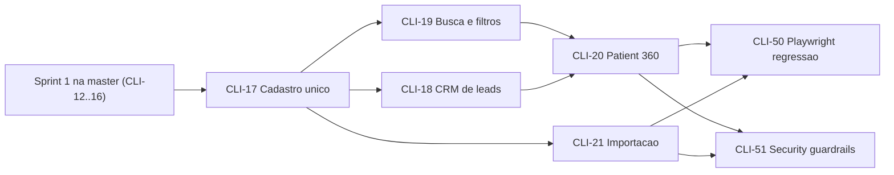
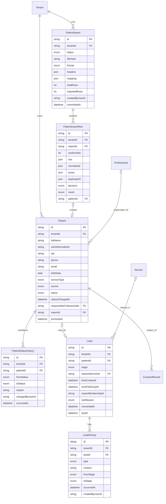

# Plano de implementação — Sprint 2 (Patient 360)

**Feature pai:** [CLI-67 — Feature P0: Cadastro e Patient 360 core](https://linear.app/clivyra/issue/CLI-67/feature-p0-cadastro-e-patient-360-core)
**Milestone:** Sprint 2 — Patient 360
**Objetivo:** centralizar o cadastro e o contexto básico da pessoa (paciente/aluno/lead) para reduzir duplicidade e busca manual no piloto Studio Vega, sobre a base de tenant, auth, RBAC, auditoria e LGPD da Sprint 1.

> Este documento é um **plano**. Nada aqui foi implementado. Cada card tem uma spec própria em
> [`docs/sprint-2/specs/`](./specs/) com modelo de dados, contratos de API, regras, testes e plano de execução.

---

## 1. Sequência e dependências

| Ordem | Card | Título | Prioridade | Status Linear | Escopo | Spec |
| --- | --- | --- | --- | --- | --- | --- |
| 1 | [CLI-17](https://linear.app/clivyra/issue/CLI-17) | Cadastro único de paciente/cliente | Urgent | Backlog | P0 (filho de CLI-67) | [CLI-17](./specs/CLI-17-patient-registration.md) |
| 2a | [CLI-19](https://linear.app/clivyra/issue/CLI-19) | Busca inteligente e filtros de pacientes | High | Backlog | P0 (filho de CLI-67) | [CLI-19](./specs/CLI-19-patient-search-filters.md) |
| 2b | [CLI-18](https://linear.app/clivyra/issue/CLI-18) | CRM de leads e funil de conversão | High | Backlog | **Não-P0** (ver §1.2) | [CLI-18](./specs/CLI-18-leads-crm.md) |
| 3 | [CLI-20](https://linear.app/clivyra/issue/CLI-20) | Tela Patient 360 e ficha rápida | Urgent | Backlog | P0 (filho de CLI-67) | [CLI-20](./specs/CLI-20-patient-360.md) |
| 4 | [CLI-21](https://linear.app/clivyra/issue/CLI-21) | Importação inicial de pacientes e deduplicação | High | Backlog | **Não-P0** (ver §1.2) | [CLI-21](./specs/CLI-21-patient-import.md) |

Gates da sprint (fora deste plano, mas dependentes dele): **CLI-50** (Playwright E2E) e **CLI-51** (Security guardrails). Os dois citam explicitamente cenários de lead e de importação, por isso CLI-18 e CLI-21 entram no plano.

### 1.1 Por que essa ordem

1. **CLI-17** é a entidade central da sprint: `Patient` é o sujeito de consentimento (CLI-15), o alvo da busca (CLI-19), o dono da ficha 360 (CLI-20), a pessoa por trás do lead (CLI-18) e o destino da importação (CLI-21). Carrega as fundações transversais da sprint (§3).
2. **CLI-19** e **CLI-18** dependem só de CLI-17 e andam **em paralelo**. CLI-19 entrega a listagem operacional que CLI-20 usa para chegar ao paciente; CLI-18 entrega a seção "Lead/CRM" que CLI-20 exibe.
3. **CLI-20** compõe tudo: precisa da busca para navegar, do cadastro para editar e do lead para a timeline. Define o contrato de seções que as Sprints 3–5 vão preencher.
4. **CLI-21** depende só de CLI-17 (regras de validação e deduplicação reutilizadas) e pode andar em paralelo com CLI-19/18/20. É o último a mergear por ser não-P0 e por ter a maior superfície de segurança (upload).

### 1.2 Classificação de escopo (CLI-18 e CLI-21)

- [`docs/discovery-closure.md`](../discovery-closure.md) lista **CRM** como pós-piloto e CLI-67 diz "sem CRM ou portal do paciente"; CLI-18 e CLI-21 não são filhos de CLI-67.
- Ambos estão no milestone Sprint 2 e são exigidos pelos gates CLI-50/51 ("cadastrar lead e converter", "importação com preview").
- Decisão registrada neste plano: **incluir os dois**, marcados como não-P0. Podem ser adiados para o início da Sprint 3 sem quebrar CLI-19/20 (a seção "Lead/CRM" do 360 fica `UNAVAILABLE`; a importação do Studio Vega pode ser feita via seed até o card existir). A ordem de PRs (§10) reflete isso.
- Follow-up sugerido para o PO: vincular CLI-18/21 a CLI-67 ou criar feature pai própria, para o Linear refletir a decisão.

---

## 2. Estado atual do repositório

### 2.1 `master` (verificado em `origin/master` = `77284f5`)

| Área | Estado |
| --- | --- |
| Sprint 0 | Monorepo, Next.js PWA, NestJS, Prisma, CI `pr-check.yml`, deploy OCI |
| CLI-11 | **Mergeado** (#23): `Tenant`/`User`/`Membership`, `TenantContextGuard`, `tenantScoped` Prisma extension, `TENANT_OWNED_MODELS`, `RequestContext`/logger, harness `test:integration` com `studio-a`/`studio-b`, `check-tenant-boundaries.mjs` |
| CLI-12, CLI-13, CLI-14 | PRs #24, #25, #26 **mergeados empilhados** (base = branch anterior), **não estão na `master`**. Conteúdo completo em `origin/cursor/cli-14-audit-a1bc`: auth + sessão, RBAC global deny-by-default, convites/gestão de usuários, `AuditLog` append-only com `@Audited`, web `/login`, `/app`, `/app/configuracoes/usuarios`, `/app/configuracoes/auditoria`, BFF `apps/web/app/api/**` |
| CLI-15, CLI-16 | Não iniciados (specs em `docs/sprint-1/specs/`) |
| Schema Prisma na `master` | `SystemMetadata`, `Tenant`, `User`, `Membership` |
| Schema na branch CLI-14 | + `RefreshSession`, `PasswordResetToken`, `Invitation`, `AuditLog` |

### 2.2 Dependências duras da Sprint 2 sobre a Sprint 1

| Dependência | Consumida por | Estado | Se não estiver pronta |
| --- | --- | --- | --- |
| Retarget de CLI-12/13/14 para `master` | Todos (auth, `@RequirePermissions`, `@Audited`) | Pendente | **Bloqueia** o primeiro PR da sprint; nenhum endpoint de paciente pode existir sem RBAC global |
| CLI-15 (`ConsentSubjectType.PATIENT`, `SubjectResolverPort`, `DataExporterPort`, `DataAnonymizerPort`, `ConsentCapture`) | CLI-17 (consentimento no cadastro, export/anonimização do paciente) | Não iniciado | CLI-17 entrega o `Patient` sem captura de consentimento e registra os ports quando CLI-15 mergear (fase 2 do card, §11 da spec) |
| CLI-16 (`Service`, `Professional`) | CLI-17 (`responsibleProfessionalId`), CLI-18 (`interestServiceId`), CLI-19 (filtro por serviço) | Não iniciado | FKs entram como fase 2; enquanto isso `serviceType` (enum) cobre Pilates/Fisioterapia/Terapias |
| `FileStoragePort` (CLI-16) | CLI-21 | Não iniciado | CLI-21 **não depende**: o arquivo é parseado em memória e descartado; só linhas vão ao banco |

**Regra do plano:** nenhum card da Sprint 2 reimplementa fundações da Sprint 1. Se uma dependência não estiver na `master`, o card reporta a dependência (AGENTS.md §9) e entrega a fase que não depende dela.

### 2.3 Contratos da Sprint 1 que a Sprint 2 consome (como existem hoje na branch CLI-14)

| Contrato | Onde | Uso na Sprint 2 |
| --- | --- | --- |
| `PERMISSIONS` já contém `clients:read` / `clients:write` para os 4 papéis | `packages/types/src/rbac.ts` | Base de `Patient`; a sprint só **adiciona** entradas (§5) |
| `@RequirePermissions(...)`, `@RequireAnyPermission(...)`, deny by default | `apps/api/src/rbac/` | Toda rota nova declara permissão |
| `AuthorizationService.project(ctx, dto, sensitiveFields)` | `apps/api/src/rbac/authorization.service.ts` | Projeção de CPF/telefone por papel |
| `@Audited({ action, entityType, entityIdFrom })`, `AuditService.record/recordAccess`, `AUDIT_ACTIONS`, `AUDIT_METADATA_ALLOWLIST` | `apps/api/src/audit/`, `packages/types/src/audit.ts` | Ações novas (§6.3), `changes` com máscara |
| `TENANT_OWNED_MODELS` + extension (`create` sobrescreve `tenantId`; `findMany` exige filtro) | `apps/api/src/prisma/` | Todos os modelos novos entram no registro |
| `scripts/check-audited-modules.mjs` (`SENSITIVE_MODULES`) | `scripts/` | Adicionar `patients`, `leads`, `patient-import` |
| `scripts/check-tenant-boundaries.mjs` | `scripts/` | DTOs novos sem `tenantId` |
| Fixtures `studio-a`/`studio-b`, `ownerA`, `proA`, `ownerB`, `multiOwner` | `apps/api/test/integration/setup/fixtures.ts` | Ampliadas com pacientes sintéticos (§8) |
| BFF Next (`apps/web/app/api/**` com `assertSameOrigin` + cookie de acesso), `apiFetch`, `SessionProvider` | `apps/web/lib/session/` | Rotas BFF novas para pacientes/leads/importação |
| Erros `{ statusCode, error, message, requestId }`; `404` para recurso de outro tenant; cursor `?cursor&limit≤100` | Convenção Sprint 1 | Mantida |

---

## 3. Fundações transversais (entram no PR do CLI-17)

Não são expansão de escopo: são pré-condições dos critérios de aceite "CPF/telefone evitam duplicidade dentro do tenant" e "busca e ficha rápida não expõem dados de outro tenant".

| Fundação | Onde | Consumido por |
| --- | --- | --- |
| Validadores e normalizadores de **CPF** (dígitos verificadores), **telefone** (E.164, default `+55`), **e-mail**, **nome normalizado** (`unaccent` + lower + espaços) | `packages/shared/src/br/` (sem dependência de domínio) | CLI-17, 19, 21; web (máscaras espelham o servidor) |
| Máscaras de exibição (`***.***.***-12`, `+55 (11) *****-1234`) | `packages/shared/src/masking.ts` | Listagens, auditoria, logs |
| `csvSafeCell()` (neutraliza `= + - @ \t \r` no início da célula) | `packages/shared/src/csv-safety.ts` | CLI-21 hoje; exportações futuras (CLI-51) |
| Enums e views de domínio (`PatientStatus`, `ServiceType`, `PatientSource`, `PatientListItemView`, `PatientDetailView`, `PatientSummaryView`, `LeadStage`, filtros) | `packages/types/src/patients.ts`, `leads.ts`, `patient-search.ts`, `patient-import.ts` | Web e API |
| Extensões Postgres `unaccent` e `pg_trgm` (migration `CREATE EXTENSION IF NOT EXISTS`) + service Postgres do CI com as extensões disponíveis | `prisma/migrations/`, `.github/workflows/ci.yml` | CLI-19 (índice GIN em `nameNormalized`) |
| `PatientStatusPolicy` (máquina de transições) e evento interno `patient.status.changed` (`PatientStatusListenerPort`, registro por módulo) | `apps/api/src/patients/domain/` | CLI-18 (sincroniza `Lead.stage`), CLI-20 (timeline) |
| Módulo `patients` em `SENSITIVE_MODULES` e novos modelos em `TENANT_OWNED_MODELS` | `scripts/`, `apps/api/src/prisma/` | Standards |
| Fixtures de integração com pacientes sintéticos em A e B | `apps/api/test/integration/setup/fixtures.ts` | CLI-17..21 |

---

## 4. Modelo de dados consolidado (visão da sprint)

Regras que valem para **todas** as tabelas novas (herdadas da Sprint 1):

- `tenantId` obrigatório com FK para `Tenant` (`onDelete: Restrict` — dados de pessoas são regulatórios) em toda entidade; `PatientStatusHistory`, `LeadActivity` e `PatientImportRow` carregam `tenantId` redundante para filtro sem join.
- Índices começam por `tenantId`; uniques de negócio são compostos com `tenantId` e **parciais** quando o campo é opcional (`cpf`, `phone`, `externalId`) e quando há soft-delete (`archivedAt IS NULL`).
- `PatientStatusHistory` e `LeadActivity` são append-only (mesma função `append_only_guard` de CLI-14/15).
- Soft-delete via `archivedAt` em `Patient`; exclusão física só via anonimização LGPD (CLI-15 `DataAnonymizerPort`).
- Nenhuma migration destrutiva na sprint. Tabelas novas apenas; FKs para `Professional`/`Service` (CLI-16) e `ConsentRecord.subjectId → Patient` (CLI-15) entram quando os cards estiverem na `master`, sempre nullable.
- Nenhum dado clínico em nenhuma tabela desta sprint (`notes` é administrativo; a spec de CLI-17 lista o que é proibido).

---

## 5. Matriz de permissões alvo (incremental)

Catálogo em `packages/types/src/rbac.ts`. Cada card só **adiciona** entradas. `clients:read`/`clients:write` já existem para os 4 papéis (Sprint 1).

| Permissão | OWNER | ADMIN | PROFESSIONAL | RECEPTION | Introduzida em |
| --- | :-: | :-: | :-: | :-: | --- |
| `clients:read` (lista, busca, detalhe com CPF mascarado, 360 sem seções clínicas/financeiras) | ✓ | ✓ | ✓ | ✓ | CLI-13 (existente) |
| `clients:write` (criar, editar, trocar status, revelar CPF) | ✓ | ✓ | ✓ | ✓ | CLI-13 (existente) |
| `clients:archive` (arquivar/restaurar, override de telefone duplicado) | ✓ | ✓ | – | – | CLI-17 |
| `clients:import` (importação em lote) | ✓ | ✓ | – | – | CLI-21 |
| `leads:read` (funil, lista, seção Lead do 360) | ✓ | ✓ | ✓ | ✓ | CLI-18 |
| `leads:write` (criar/editar lead, follow-up, converter, perder) | ✓ | ✓ | – (D15) | ✓ | CLI-18 |

Seções do Patient 360 herdam a permissão do módulo dono: `agenda` → `agenda:read`, `finance` → `finance:read`, `anamnesis`/`evaluation`/`evolution`/`therapeutic-plan`/`documents` → `clinical-record:read`, `lead` → `leads:read`. RECEPTION nunca recebe seções clínicas nem financeiras — a seção é **omitida** da resposta, não devolvida vazia.

Regras fixas mantidas: deny by default; `404` para paciente de outro tenant; `finance` e `clinical-record` nunca derivam de `clients:*`.

---

## 6. Contratos de API por card (índice)

### 6.1 Endpoints

| Card | Endpoints (API própria em `:3001`; BFF Next espelha em `apps/web/app/api/**`) |
| --- | --- |
| CLI-17 | `GET /patients` (lista paginada, CPF mascarado), `POST /patients`, `GET /patients/:id`, `PATCH /patients/:id`, `POST /patients/:id/status`, `GET /patients/:id/status-history`, `POST /patients/:id/archive`, `POST /patients/:id/restore`, `GET /patients/:id/cpf` (revela; auditado), `POST /patients/check-duplicates`, `POST /patients/:id/allow-shared-phone` |
| CLI-18 | `GET /leads` (lista com filtros de estágio/follow-up), `POST /leads` (cria pessoa + lead ou lead para paciente `LEAD` existente), `GET /leads/:id`, `PATCH /leads/:id`, `POST /leads/:id/activities`, `GET /leads/:id/activities`, `POST /leads/:id/convert`, `POST /leads/:id/lose`, `POST /leads/:id/reopen`, `GET /leads/funnel`, `GET /leads/follow-ups?due=overdue\|today\|week` |
| CLI-19 | `GET /patients/search?q&status[]&serviceType[]&isLead&activity&birthdayMonth&...&sort&cursor&limit`, `GET /patients/filters` (catálogo de filtros com disponibilidade) |
| CLI-20 | `GET /patients/:id/summary` (cabeçalho + ficha rápida + seções permitidas), `GET /patients/:id/timeline?cursor&types[]` |
| CLI-21 | `POST /patient-imports` (multipart), `GET /patient-imports`, `GET /patient-imports/:id`, `POST /patient-imports/:id/mapping`, `GET /patient-imports/:id/preview?cursor&only=errors\|duplicates`, `PATCH /patient-imports/:id/rows/:rowNumber` (decisão por linha), `POST /patient-imports/:id/commit`, `GET /patient-imports/:id/report`, `POST /patient-imports/:id/cancel`, `DELETE /patient-imports/:id/rows` (purga antecipada), `GET /patient-imports/:id/progress`, `GET /patient-imports/template.csv`, `GET /patient-imports/limits` |

Convenções comuns: erros `{ statusCode, error, message, requestId }` com `code` de domínio (`PATIENT_DUPLICATE_CPF`, `PATIENT_INVALID_TRANSITION`, `FILTER_NOT_AVAILABLE`, `IMPORT_FILE_TOO_LARGE`…); `404` para recurso de outro tenant; `409` para duplicidade e transição inválida; paginação por cursor (`limit ≤ 100`); DTOs `class-validator` com allowlist (`whitelist` + `forbidNonWhitelisted` globais); nenhum DTO aceita `tenantId`.

### 6.2 Ports (contratos entre módulos)

| Port | Definido em | Implementado em | Objetivo |
| --- | --- | --- | --- |
| `PatientStatusListenerPort` | CLI-17 | CLI-18 (`Lead.stage` segue `Patient.status`) | Evitar dependência circular `patients ↔ leads` |
| `PatientFilterProviderPort` | CLI-19 | CLI-19 (`status`, `serviceType`, `isLead`, `activity`, `birthdayMonth`), CLI-18 (`leadStage`, `followUpOverdue`), Sprints 3/4 (`overdue`, `planExpiring`, `noAttendance`, `noRenewal`, `planId`) | Filtros combináveis com disponibilidade declarada |
| `PatientSummarySectionPort` | CLI-20 | CLI-17 (`registration`), CLI-18 (`lead`), CLI-20 (`history`), Sprints 3–5 (`agenda`, `finance`, `anamnesis`, `evaluation`, `evolution`, `therapeutic-plan`, `documents`) | Seções do 360 por módulo com permissão própria |
| `PatientTimelineSourcePort` | CLI-20 | CLI-17 (status), CLI-18 (atividades), CLI-20 (auditoria filtrada) | Histórico cronológico único |
| `SubjectResolverPort` / `DataExporterPort` / `DataAnonymizerPort` (`PATIENT`, `LEAD`) | CLI-15 | CLI-17 (fase 2), CLI-18 | LGPD: existência do sujeito, exportação e anonimização |

### 6.3 Ações de auditoria novas (`AUDIT_ACTIONS` + allowlists)

| Ação | Card | Metadata permitida | `changes` |
| --- | --- | --- | --- |
| `patient.created`, `patient.updated` | CLI-17 | `['origin']` (`MANUAL` \| `LEAD_CONVERSION` \| `IMPORT`) | campos alterados; `cpf`, `phone`, `email`, `emergencyContactPhone` **mascarados** |
| `patient.status_changed` | CLI-17 | `['fromStatus', 'toStatus']` (motivo só em `PatientStatusHistory`) | – |
| `patient.archived`, `patient.restored` | CLI-17 | `[]` | – |
| `patient.cpf.revealed` | CLI-17 | `[]` (`recordAccess`) | – |
| `patient.duplicate_override` | CLI-17 | `['matchedBy', 'existingPatientId']` | – |
| `lead.created`, `lead.updated`, `lead.stage_changed`, `lead.activity_added`, `lead.converted`, `lead.lost`, `lead.reopened` | CLI-18 | `['fromStage', 'toStage']`, `['toPatientStatus']`, `['lostReason']`, `['activityType']` (nunca `content`) | campos não textuais |
| `patient.search.performed` | CLI-19 | **não auditar** (listagem comum, CLI-14 §"volume") | – |
| `patient.summary.viewed` | CLI-20 | **não auditar** no P0 (D14); CPF só via `patient.cpf.revealed` | – |
| `patient.import.uploaded`, `patient.import.mapped`, `patient.import.committed`, `patient.import.cancelled`, `patient.import.purged` | CLI-21 | `['format', 'totalRows']`, `['mappedFields']`, `['totalRows', 'importedRows', 'skippedRows', 'duplicateRows', 'failedRows']`, `[]`, `['rowsPurged']` | – |

Rótulos pt-BR em `AUDIT_ACTION_LABELS_PT`. Nenhuma allowlist admite texto livre (`notes`, `reason`, `content`) — mesma regra de `CLINICAL_RECORD_TEXT_KEYS_FORBIDDEN`.

---

## 7. Frontend (apps/web) na sprint

| Card | Entrega web (mobile-first, PWA) |
| --- | --- |
| CLI-17 | `/app/pacientes` (lista básica — substituída pela busca de CLI-19), `/app/pacientes/novo`, `/app/pacientes/[id]/editar`, componente `PatientStatusChip` com troca rápida (bottom sheet no mobile), alerta de duplicidade inline (CPF/telefone) enquanto digita, máscaras espelhando `packages/shared` |
| CLI-18 | `/app/leads` (funil por estágio em colunas roláveis no mobile + lista "follow-ups vencidos"), `/app/leads/novo`, ações no card do lead (registrar contato, agendar follow-up, converter, marcar não convertido) |
| CLI-19 | Barra de busca fixa no topo de `/app/pacientes` (nome/CPF/telefone/nascimento), chips de filtro combináveis, resultados em cards, ordenação, scroll infinito por cursor; filtros indisponíveis aparecem desabilitados com "disponível na Sprint X" |
| CLI-20 | `/app/pacientes/[id]` com cabeçalho, ficha rápida, abas (Resumo, Cadastro, Agenda, Financeiro, Anamnese, Avaliação, Evolução, Plano terapêutico, Documentos, Histórico); abas `UNAVAILABLE` com estado vazio "disponível na Sprint X"; abas sem permissão **não aparecem**; ações rápidas (WhatsApp via `wa.me`, editar cadastro, trocar status; agenda/financeiro/prontuário desabilitadas até existirem) |
| CLI-21 | Wizard `/app/pacientes/importar`: upload → mapeamento de colunas → preview (erros, duplicados, decisão por linha) → confirmação → relatório; retomável por `importId` |

Toda proteção de rota web é UX; a autorização real é na API. `sw.js` não cacheia `/api/patients/**`, `/api/leads/**` nem `/api/patient-imports/**`.

---

## 8. Estratégia de testes

| Nível | Ferramenta | Onde | Regra |
| --- | --- | --- | --- |
| Unit | Jest | `apps/api/src/**/*.spec.ts`, `packages/shared`, `packages/types` | Validadores CPF/telefone/e-mail, normalizador de nome, máscaras, `csvSafeCell`, `PatientStatusPolicy`, classificador de busca, mapeador de colunas, detector de duplicados, parser CSV com limites |
| Integration | Jest + Nest Testing + Postgres real | `apps/api/test/integration/*.integration.spec.ts` | Todo card adiciona pelo menos: 1 cenário cross-tenant (`404`), 1 de `403` por papel, 1 de duplicidade/`409`, 1 de auditoria com máscara. CLI-19 prova `unaccent`/`pg_trgm`; CLI-21 prova limites de upload e magic bytes |
| E2E | Playwright (skill `domain-rules-playwright`, Given/When/Then) | `tests/e2e/` | Cenários mínimos de CLI-50: criar/editar paciente, impedir duplicidade, lead → cliente sem recadastro, busca por nome/CPF/telefone, filtros combinados, abertura do 360, importação com preview e erros, isolamento de tenant |
| Standards | `check:standards` | CI | `tenantId` em DTO, `@Audited` em `patients`/`leads`/`patient-import`, ports LGPD registrados (`check-lgpd-ports.mjs` de CLI-15 quando existir) |

Fixture padrão de integração (ampliada em CLI-17): em `studio-a` 5 pacientes sintéticos (`Paciente A1..A5`: 2 `LEAD`, 1 `ACTIVE` Pilates, 1 `IN_TREATMENT` Fisioterapia, 1 `INACTIVE`), em `studio-b` 2 pacientes; CPFs gerados por algoritmo (dígitos verificadores válidos, prefixo `000.000.0xx`, nunca reais); telefones `+55 11 90000-00xx`; nascimento fixo por índice. Nenhum dado real do Studio Vega em fixture, teste ou artefato Playwright; screenshots sem o campo CPF revelado.

---

## 9. Decisões em aberto (precisam de PO/tech lead antes do PR correspondente)

| # | Decisão | Card | Recomendação | Impacto se adiada |
| --- | --- | --- | --- | --- |
| D10 | CPF obrigatório no cadastro? | CLI-17 | **Opcional** (leads e menores não têm CPF na primeira visita); obrigatório pode virar configuração do tenant no card financeiro (NFS-e) | Nenhum; campo nullable |
| D11 | Telefone duplicado: bloqueio duro ou aviso? | CLI-17 | Duro por padrão (critério do card); override explícito `allowSharedPhone` com `clients:archive` e auditoria `patient.duplicate_override` (responsável por menor, casal) | Sem override, cadastro de dependentes trava |
| D12 | Suporte a XLSX no P0 ou só CSV? | CLI-21 | CSV obrigatório (`csv-parse`, sem nativo). XLSX via `exceljs` atrás de `PATIENT_IMPORT_XLSX_ENABLED` **somente** após checagem de vulnerabilidades/licença da dependência; UI orienta "salvar como CSV" | Piloto importa CSV; XLSX é conveniência |
| D13 | Quem vê CPF completo? | CLI-17 | Sempre mascarado em lista/detalhe/360; `GET /patients/:id/cpf` revela para `clients:write` e grava `patient.cpf.revealed` | Sem decisão, CPF fica só mascarado |
| D14 | Auditar abertura do Patient 360? | CLI-20 | **Não** no P0 (volume, CLI-14 §volume); auditar só revelação de CPF e exportações. Revisar quando seções clínicas existirem (Sprint 5 deve auditar `clinical-record.viewed`) | Nenhum |
| D15 | PROFESSIONAL escreve em leads? | CLI-18 | **Não** no P0 (só leitura); em studio pequeno o OWNER/RECEPTION fazem follow-up. Flag de matriz fácil de mudar | Matriz muda |
| D16 | Retenção das linhas de importação (contêm PII bruta) | CLI-21 | Linhas `CREATED` perdem `raw`/`normalized` no commit; linhas com erro mantidas para o relatório; purga total após `PATIENT_IMPORT_ROW_RETENTION_DAYS=30` (job) ou na próxima importação do tenant | Sem purga, PII bruta fica indefinidamente |
| D17 | Fonte da verdade lead vs. paciente | CLI-17/18 | `Patient.status` é o ciclo de vida (inclui `LEAD`, `EVALUATION_SCHEDULED`, `NOT_CONVERTED`); `Lead.stage` detalha o funil dentro de `LEAD`. Conversão nunca volta a lead | Sem decisão, dois status divergem |
| D18 | Campos de identidade além do card (nome social, gênero) | CLI-17 | Incluir `socialName` (inclusão; usado na UI quando presente); **não** incluir gênero/sexo (minimização; entra no clínico se necessário) | Nenhum |
| D19 | Busca: `unaccent` + `pg_trgm` ou `ILIKE` simples? | CLI-19 | Extensões (trusted no Postgres ≥ 13; disponíveis na imagem oficial usada no CI e no OCI); fallback `ILIKE` em `nameNormalized` se a extensão não puder ser criada, decidido na migration | Busca sem acento/erro de digitação fica pior |
| D20 | Estágios do funil fixos ou configuráveis por tenant | CLI-18 | Fixos no P0 (critério do card lista os seis); configuração é pós-piloto | Nenhum |

---

## 10. Ordem de PRs e critérios de merge

| # | PR | Base | Conteúdo | Gate mínimo |
| --- | --- | --- | --- | --- |
| 0 | Retarget CLI-12/13/14 → `master`; CLI-15; CLI-16 | `master` | Sprint 1 | Fora deste plano; **pré-requisito** |
| 1 | `docs: plano e specs Sprint 2` (este) | `master` | Docs | Review |
| 2 | `CLI-17 — Cadastro único de paciente/cliente` | `master` | `Patient`, histórico de status, validadores compartilhados, extensões Postgres, ports LGPD (se CLI-15 estiver na `master`), web cadastro | lint, typecheck, unit, **integration cross-tenant + duplicidade + auditoria mascarada**, security review |
| 3a | `CLI-19 — Busca inteligente e filtros` | PR 2 → `master` | Busca, catálogo de filtros, índice GIN, web lista/busca | + prova `unaccent`/`pg_trgm`, filtros combinados, `FILTER_NOT_AVAILABLE`, E2E busca |
| 3b | `CLI-18 — CRM de leads e funil` | PR 2 → `master` | `Lead`, `LeadActivity`, funil, conversão, listener de status, web funil | + conversão preserva histórico, follow-up vencido, E2E lead → cliente |
| 4 | `CLI-20 — Patient 360 e ficha rápida` | PRs 3a+3b → `master` | Contrato de seções, summary, timeline, web 360 | + seções omitidas por papel (RECEPTION sem clínico), IDOR cross-tenant, E2E abertura do 360 |
| 5 | `CLI-21 — Importação e deduplicação` | PR 2 → `master` (paralelo a 3–4) | Upload seguro, mapeamento, preview, commit por lote, relatório, purga, web wizard | + magic bytes, limites, formula injection, idempotência, linha inválida não aborta lote, E2E importação |
| 6 | CLI-50 / CLI-51 | `master` | Regressão E2E e guardrails sobre o conjunto | Sprint só fecha com ambos verdes |

Cada PR: título `CLI-XX — <título>`, branch `feat/CLI-XX-<slug>`, commits com ID Linear, checklist do `AGENTS.md` §20 no corpo, revisão por CI → Playwright → Security → Codex → CodeRabbit → humano.

---

## 11. Variáveis de ambiente novas (consolidado)

| Variável | Card | Obrigatória em prod | Default dev |
| --- | --- | --- | --- |
| `PATIENT_DEFAULT_PHONE_COUNTRY` | CLI-17 | não | `BR` |
| `PATIENT_SEARCH_MIN_QUERY_LENGTH` | CLI-19 | não | `2` |
| `PATIENT_SEARCH_TRGM_ENABLED` | CLI-19 | não | `true` (migration decide fallback) |
| `PATIENT_IMPORT_MAX_BYTES` | CLI-21 | não | `5242880` (5 MB) |
| `PATIENT_IMPORT_MAX_ROWS` | CLI-21 | não | `5000` |
| `PATIENT_IMPORT_MAX_COLUMNS` | CLI-21 | não | `40` |
| `PATIENT_IMPORT_XLSX_ENABLED` | CLI-21 | não | `false` (D12) |
| `PATIENT_IMPORT_XLSX_MAX_BYTES` | CLI-21 | não | `2097152` (2 MB; teto próprio contra zip bomb) |
| `PATIENT_IMPORT_ROW_RETENTION_DAYS` | CLI-21 | não | `30` |

Nenhum segredo novo nesta sprint. Limites de importação são teto; a UI exibe os valores efetivos.

---

## 12. Riscos

| Risco | Mitigação |
| --- | --- |
| Sprint 1 não chegar inteira à `master` antes de CLI-17 | PR 0 explícito; CLI-17 não inicia sem `@RequirePermissions`/`@Audited` na `master`. Se CLI-15/16 atrasarem, CLI-17 entrega fase 1 (sem consentimento/FKs) e reporta dependência |
| Extensões Postgres indisponíveis em algum ambiente | Migration com `CREATE EXTENSION IF NOT EXISTS` e fallback `ILIKE` (D19); job de CI já usa imagem oficial |
| Deduplicação bloquear casos legítimos (telefone compartilhado, CPF de responsável) | D11 override auditado; CPF é da pessoa, não do responsável (campo separado no contato de emergência) |
| PII bruta em `PatientImportRow` | D16: limpeza no commit e purga por retenção; `raw` nunca em logs nem em auditoria |
| Upload como vetor (zip bomb em XLSX, CSV gigante, polyglot) | Limites de bytes/linhas/colunas antes do parse, magic bytes, parse em streaming para CSV, XLSX atrás de flag, arquivo nunca persistido |
| Formula injection em exportações futuras | `csvSafeCell()` em `packages/shared` desde já; CLI-51 verifica |
| Abas do 360 dependentes de sprints futuras gerarem expectativa | Estado vazio explícito "disponível na Sprint X"; contrato `PatientSummarySectionPort` documentado para as próximas sprints plugarem |
| `Patient.status` e `Lead.stage` divergirem | D17 + `PatientStatusListenerPort` na mesma transação; teste de integração de sincronização nos dois sentidos |
| Volume de auditoria em importação | Um registro `patient.import.committed` com contagens + `Patient.importId` para rastreabilidade; sem `patient.created` por linha |
| PII em fixtures e artefatos Playwright | Dados sintéticos gerados por algoritmo; CPF sempre mascarado nas telas gravadas; `.gitignore` de `test-results/` |

---

## 13. Definition of Done da sprint

- [ ] CLI-17, 19, 20 mergeados na `master` com PRs individuais (P0); CLI-18 e CLI-21 mergeados ou formalmente movidos com registro no Linear
- [ ] Toda tabela nova tem `tenantId` + FK + índice iniciando por `tenantId`; uniques parciais de CPF/telefone provados
- [ ] Nenhuma rota nova sem `@RequirePermissions`; `check:standards` verde com `patients`/`leads`/`patient-import` em `SENSITIVE_MODULES`
- [ ] Testes de integração provam: cross-tenant `404` em pacientes/leads/importações, `403` por papel, duplicidade `409`, transição inválida `409`, conversão preserva histórico, CPF mascarado em lista/auditoria, filtros indisponíveis `400`, upload inválido rejeitado, linha inválida não aborta lote
- [ ] E2E Playwright: cenários mínimos de CLI-50 verdes no CI, com trace/screenshot em falha e sem PII real
- [ ] Security review sem BLOCKER/HIGH em cada PR; CLI-51 executado sobre o conjunto
- [ ] Docs: `docs/patients.md`, `docs/leads-crm.md`, `docs/patient-search.md`, `docs/patient-360.md` (contrato de seções para Sprints 3–5), `docs/patient-import.md`, `README.md` (env vars)
- [ ] Decisões D10–D20 registradas com resultado

---

## Referências

- `AGENTS.md` — regras de multi-tenancy, segurança, LGPD, PR e Definition of Done
- [`docs/sprint-1/PLANO_IMPLEMENTACAO.md`](../sprint-1/PLANO_IMPLEMENTACAO.md) e specs CLI-11..16 — fundações consumidas
- [`docs/tenant-context.md`](../tenant-context.md) — extension `tenantScoped`, `bypassTenant`
- [`docs/discovery-closure.md`](../discovery-closure.md) — escopo P0 aprovado (CRM pós-piloto)
- `.cursor/skills/domain-rules-playwright/` — cenários Given/When/Then e checklist de domínio
- Branch de referência da Sprint 1 completa: `origin/cursor/cli-14-audit-a1bc`
