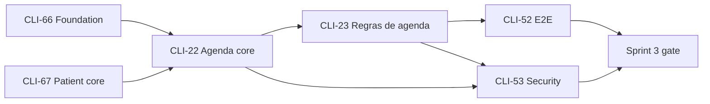
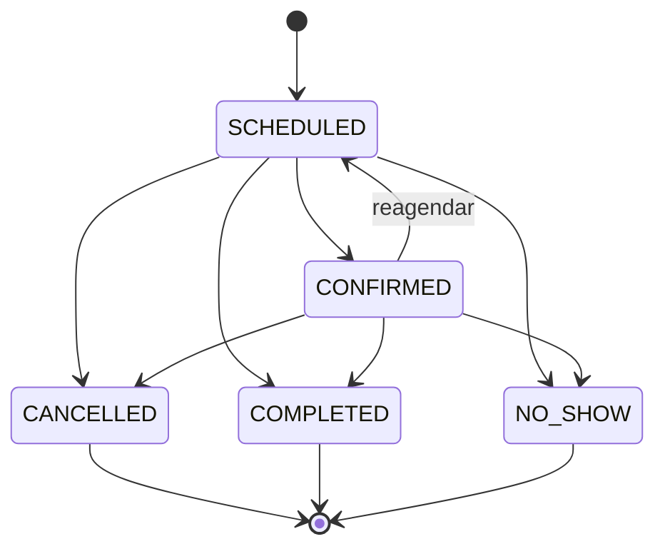
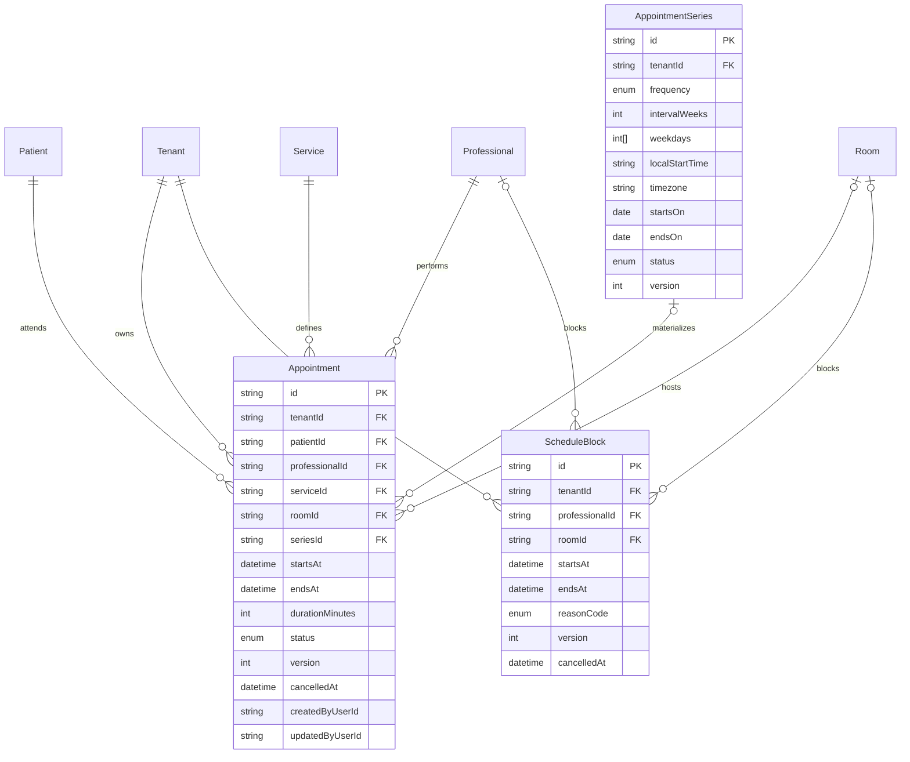

# Plano de implementação — Sprint 3 (Agenda operacional core)

**Feature pai:** [CLI-68 — Feature P0: Agenda operacional core](https://linear.app/clivyra/issue/CLI-68/feature-p0-agenda-operacional-core)  
**Milestone:** Sprint 3 — Agenda  
**Prioridade:** P0  
**Objetivo:** substituir a agenda fragmentada do Studio Vega por um fluxo nativo, seguro e utilizável no celular para consultar, criar, reagendar, confirmar, concluir e cancelar atendimentos sem dupla reserva.

> Este documento é um **plano**. Nada da Sprint 3 foi implementado aqui. Cada card do recorte
> P0 tem uma spec própria em [`docs/sprint-3/specs/`](./specs/).

---

## 1. Decisão de produto e recorte

### 1.1 Precedência das fontes

Há uma divergência entre documentos antigos e o recorte canônico atualizado em
12 set. 2026:

| Fonte | Conteúdo | Decisão |
| --- | --- | --- |
| Notion — Produto & Entrega / Implementation Sequence | Sprint 3 = agenda dia/semana, criar/reagendar/cancelar, conflitos e status; sem turmas/reposição | **Canônico** |
| Linear — milestone Sprint 3 e feature CLI-68 | Mesmo recorte P0; CLI-22 e CLI-23 como cards | **Canônico de execução** |
| PRD Scheduling & Pilates (22 ago. 2026) | Mistura agenda P0, turmas, presença, reposição e integrações | Usar apenas a parte de agenda; restante foi reclassificado |
| Página antiga de specs por issue | Ainda descreve CLI-24..26 e os gates CLI-52/53 como Sprint 3 | Stale; não usar para expandir o P0 |

**Decisão de PO:** planejamento **APROVADO COM AJUSTE**. A Sprint 3 implementa
somente a agenda individual P0. O início da implementação permanece
**BLOQUEADO POR DEPENDÊNCIAS** até as fundações listadas no §3 chegarem à
`master`.

### 1.2 Dentro da Sprint 3

- visualização diária e semanal;
- criação, edição administrativa, reagendamento e cancelamento sem exclusão;
- confirmação e desfecho do atendimento por status;
- filtro por profissional, sala, serviço e status;
- recorrência semanal limitada, com edição de ocorrência ou desta e futuras;
- bloqueios de profissional/sala;
- cálculo de disponibilidade;
- conflito de paciente, profissional e sala validado no backend;
- isolamento por tenant, autorização por recurso e auditoria;
- fluxo mobile-first, E2E Playwright e gate de segurança.

### 1.3 Fora da Sprint 3

- visualização mensal;
- turmas, capacidade e matrículas de Pilates (CLI-24, Sprint 6/P1);
- frequência, presença como ledger, consumo de plano e saldo (CLI-25, Sprint 6/P1);
- reposição e lista de espera (CLI-26, Sprint 6/P1);
- CRM/leads;
- plano/contrato, cobrança e validação de saldo;
- autoagendamento/portal do paciente;
- WhatsApp, e-mail e Google Calendar;
- integração externa, IA ou automação;
- override manual de conflito.

`COMPLETED` e `NO_SHOW` são desfechos de um **atendimento individual**. Eles não
criam frequência, crédito, débito, saldo ou reposição de Pilates.

---

## 2. Cards e sequência

| Ordem | Card | Entrega | Status Linear em 12 set. 2026 | Spec |
| --- | --- | --- | --- | --- |
| 1 | [CLI-22](https://linear.app/clivyra/issue/CLI-22) | Agenda dia/semana e ciclo de vida do atendimento | Backlog | [CLI-22](./specs/CLI-22-agenda-operacional.md) |
| 2 | [CLI-23](https://linear.app/clivyra/issue/CLI-23) | Recorrência, conflitos, bloqueios e disponibilidade | Backlog | [CLI-23](./specs/CLI-23-recurrence-conflicts-availability.md) |
| 3 | [CLI-52](https://linear.app/clivyra/issue/CLI-52) | Regressão E2E Playwright da agenda P0 | Backlog | [CLI-52](./specs/CLI-52-sprint-3-playwright-e2e.md) |
| 4 | [CLI-53](https://linear.app/clivyra/issue/CLI-53) | Security Guardrails da agenda P0 | Backlog | [CLI-53](./specs/CLI-53-sprint-3-security-guardrails.md) |

CLI-52 e CLI-53 devem ser vinculados à CLI-68 antes de iniciar a sprint. As
descrições atuais desses dois cards ainda citam turmas, capacidade, presença,
reposição e lista de espera; o recorte correto está nas specs acima.



CLI-22 pode preparar os contratos consumidos por CLI-23, mas não deve
implementar recorrência ou cálculo de disponibilidade antecipadamente.

---

## 3. Dependências e Definition of Ready

### 3.1 Dependências obrigatórias

| Dependência | Necessidade na agenda | Condição de Ready |
| --- | --- | --- |
| CLI-11 | `TenantContext`, Prisma tenant-scoped e testes cross-tenant | Mergeada na `master` |
| CLI-12 | sessão autenticada e identidade do ator | Mergeada e rotas protegidas |
| CLI-13 | `agenda:read`/`agenda:write`, guards globais e vínculo da membership | Mergeada e matriz por papel testada |
| CLI-14 | trilha imutável para mutações da agenda | Mergeada e `@Audited` disponível |
| CLI-16 | `Professional`, `Room`, `Service`, `WorkingHours`, timezone do tenant | Mergeada, migrations aplicadas e contratos publicados |
| CLI-17 | paciente tenant-owned com identificador estável | Mergeada e busca mínima disponível |
| CLI-19 | busca de paciente usada no formulário de agendamento | Mergeada ou contrato equivalente entregue |
| CLI-20 | ação “Agendar” e resumo de próximo/último atendimento | Contrato acordado; integração pode entrar no PR de CLI-22 sem recriar Patient 360 |

Em 12 set. 2026, a `master` contém CLI-11; a pilha CLI-12..16 ainda não foi
integrada por completo e a feature CLI-67/Sprint 2 está em backlog. Portanto a
Sprint 3 **não está pronta para implementação**.

### 3.2 Checklist de Ready

- [ ] CLI-66 e CLI-67 concluídas sem BLOCKER/HIGH.
- [ ] Prisma schema real conferido após o merge das dependências; nenhuma spec é aplicada por cópia cega.
- [ ] `TenantSettings.timezone`, `Professional`, `Room`, `Service`,
  `WorkingHours` e `Patient` têm contratos estáveis.
- [ ] Permissões de agenda e política de acesso do profissional aprovadas.
- [ ] CLI-22 e CLI-23 atualizadas no Linear para refletir dia/semana e o recorte P0.
- [ ] CLI-52 e CLI-53 vinculadas à CLI-68 e sem cenários P1.

---

## 4. Invariantes de domínio

1. O tenant vem exclusivamente da sessão autenticada; nenhum DTO aceita
   `tenantId`.
2. Paciente, profissional, serviço e sala são revalidados no tenant antes de
   criar ou alterar um atendimento.
3. Intervalos usam `[startsAt, endsAt)`: atendimentos adjacentes não conflitam.
4. `startsAt < endsAt`; duração vem do serviço ativo e fica congelada no
   atendimento para preservar histórico.
5. Não pode haver sobreposição ativa para o mesmo paciente, profissional ou
   sala.
6. Bloqueio ativo de profissional ou sala torna o intervalo indisponível.
7. A validação de conflito é transacional e resistente a duas requisições
   concorrentes; checagem apenas na UI é proibida.
8. Cancelar não apaga. `CANCELLED`, `COMPLETED` e `NO_SHOW` são terminais.
9. Reagendar atendimento terminal é proibido. Reagendar um confirmado volta
   para `SCHEDULED`.
10. Toda mutação usa `version` para optimistic concurrency e registra auditoria
    sem nomes, telefone, CPF ou texto clínico.
11. Uma série é semanal, finita e materializa no máximo 104 ocorrências ou
    12 meses, o que ocorrer primeiro.
12. Alterar “esta e futuras” divide logicamente a série; ocorrências passadas e
    exceções anteriores permanecem imutáveis.
13. Não há override de conflito no P0.

### 4.1 Estados



`COMPLETED`/`NO_SHOW` só podem ser aplicados após o início do horário. Mudança
de estado usa endpoint de comando; um `PATCH` genérico não aceita `status`.

---

## 5. Modelo de dados consolidado

O schema final deve ser ajustado ao estado real após CLI-16/17. Esta é a
intenção de domínio:



Regras de persistência:

- todas as três entidades entram em `TENANT_OWNED_MODELS`;
- FKs usam `onDelete: Restrict`; desativação de paciente/profissional/serviço/sala
  não remove histórico;
- índices começam por `tenantId`, em especial
  `[tenantId, startsAt]`,
  `[tenantId, professionalId, startsAt]`,
  `[tenantId, roomId, startsAt]`,
  `[tenantId, patientId, startsAt]` e
  `[tenantId, status, startsAt]`;
- checks SQL garantem intervalo positivo, versão positiva, série finita e ao
  menos um recurso no bloqueio;
- timestamps persistidos em UTC; recorrência preserva data/hora local e timezone
  IANA para evitar deslocamento;
- migration é aditiva e deve ser validada com `prisma migrate deploy` em banco
  vazio e em snapshot do schema anterior.

### 5.1 Consistência concorrente

`ScheduleConflictService` é o único caminho de escrita de intervalos. Dentro de
uma transação:

1. valida as referências no tenant;
2. adquire locks transacionais em ordem estável para
   `(tenant, recurso, data local)`;
3. consulta atendimentos não cancelados e bloqueios sobrepostos;
4. grava a alteração com comparação de `version`;
5. emite a auditoria após sucesso da transação.

O PR deve provar com requisições paralelas que apenas uma reserva vence. Se o
banco escolhido não suportar o lock planejado, a implementação deve adotar
constraint/range lock equivalente; `findFirst` seguido de `create` sem proteção
concorrente não atende a spec.

---

## 6. Contratos de API consolidados

Todos os endpoints são privados e usam o tenant da sessão.

| Método/rota | Card | Responsabilidade |
| --- | --- | --- |
| `GET /appointments?from&to&professionalId&roomId&serviceId&status` | CLI-22 | Lista dia/semana; janela máxima de 31 dias |
| `GET /appointments/:id` | CLI-22 | Detalhe projetado por papel; cross-tenant → `404` |
| `POST /appointments` | CLI-22 | Atendimento único |
| `PATCH /appointments/:id` | CLI-22 | Paciente/serviço/profissional/sala; exige `version`, não altera status/tempo |
| `POST /appointments/:id/reschedule` | CLI-22/23 | Novo horário; `scope` entra com CLI-23 |
| `POST /appointments/:id/status` | CLI-22 | Transição explícita e validada |
| `POST /appointments/:id/cancel` | CLI-22/23 | Cancelamento preservado; `scope` entra com CLI-23 |
| `POST /appointment-series` | CLI-23 | Cria série semanal e ocorrências atomicamente |
| `PATCH /appointment-series/:id` | CLI-23 | Altera esta e futuras; exige `effectiveFrom` + `version` |
| `GET/POST/PATCH /schedule-blocks` | CLI-23 | Bloqueios de profissional/sala |
| `POST /schedule-blocks/:id/cancel` | CLI-23 | Cancela sem excluir |
| `GET /availability?professionalId&serviceId&from&to&roomId?` | CLI-23 | Slots derivados; janela máxima de 31 dias |

Erros usam `{ statusCode, code, message, requestId, details? }`:

| Código | HTTP | Uso |
| --- | --- | --- |
| `SCHEDULE_CONFLICT` | 409 | paciente/profissional/sala/bloqueio sobreposto |
| `VERSION_CONFLICT` | 409 | edição concorrente com versão antiga |
| `INVALID_STATUS_TRANSITION` | 422 | transição não permitida |
| `RECURRENCE_LIMIT_EXCEEDED` | 422 | série fora dos limites |
| `OUTSIDE_WORKING_HOURS` | 422 | slot fora da disponibilidade efetiva |
| `RESOURCE_NOT_AVAILABLE` | 422 | referência inativa ou sem vínculo |

`details.conflicts` contém apenas tipo do recurso e intervalo. Não retorna nome
de paciente ou detalhes de outro atendimento.

---

## 7. Autorização, projeção e LGPD

| Papel | Leitura | Escrita |
| --- | --- | --- |
| OWNER / ADMIN | agenda completa do tenant | todos os profissionais |
| RECEPTION | agenda completa operacional, sem dados clínicos | todos os profissionais |
| PROFESSIONAL | seus atendimentos com paciente; demais profissionais como “Ocupado” | criar/alterar para o próprio `professionalId`; atualizar desfecho dos próprios |

Controles adicionais:

- `agenda:read`/`agenda:write` são necessários, mas a política de recurso ainda
  valida “próprio profissional” para o papel PROFESSIONAL;
- resposta de listagem contém apenas nome de exibição, serviço, horário e status;
  nunca CPF, diagnóstico, anamnese ou condição clínica;
- bloqueio de outro profissional é projetado como “Indisponível”, sem motivo;
- IDs de paciente/profissional/sala/serviço de outro tenant retornam `404`;
- filtros não aceitam `tenantId`;
- auditoria registra ids, horários, estado anterior/novo e ator; não registra
  nome do paciente, telefone, CPF ou observação livre;
- respostas autenticadas, agenda e artefatos de teste não entram no cache do
  service worker.

---

## 8. Frontend mobile-first

### 8.1 Rotas

```text
/app/agenda
/app/agenda/novo
/app/agenda/[appointmentId]
/app/agenda/[appointmentId]/reagendar
/app/agenda/bloqueios
```

### 8.2 Fluxo principal

- abrir em “Hoje”/dia no timezone do tenant;
- alternar dia/semana; não renderizar opção mensal;
- filtros persistem na URL, não incluem tenant;
- FAB “Novo atendimento”;
- busca de pessoa reaproveita Sprint 2;
- formulário: pessoa → serviço → profissional → data/hora → sala opcional →
  recorrência opcional;
- conflito aparece antes do envio como auxílio, mas a resposta do servidor é a
  autoridade;
- ações rápidas: confirmar, reagendar, concluir, marcar não compareceu,
  cancelar e abrir ficha;
- após mutação, invalidar agenda e disponibilidade afetadas;
- erro de rede mantém os dados digitados e oferece “Tentar novamente”;
- modo offline não exibe cache antigo como se fosse atual.

Estados obrigatórios: skeleton, vazio com CTA, conflito recuperável, versão
desatualizada com recarga, permissão negada, offline e erro genérico com
`requestId`.

Acessibilidade: navegação por teclado no desktop, labels, foco após erro,
`aria-live` para conflito, status com texto/ícone além de cor e alvos de toque
de pelo menos 44×44 px.

---

## 9. Estratégia de testes

| Nível | Responsabilidade |
| --- | --- |
| Unit | máquina de estados, intervalos, recorrência, timezone, projeção por papel, sanitização de conflito |
| Integration + PostgreSQL | tenant, IDOR, referências cruzadas, status, auditoria, versionamento, locks concorrentes, série atômica |
| API E2E | contratos HTTP, 401/403/404/409/422, limites de data/recorrência |
| Playwright | fluxo mobile criar→confirmar→reagendar→cancelar, semana, conflito, recorrência, autorização e persistência |
| Security | cross-tenant, resource policy, mass assignment, race condition, DoS de range/recorrência, PII em logs/artefatos |

Fixtures: `studio-a`/`studio-b`, pacientes e profissionais com dados
completamente sintéticos em domínio `.test`; nenhum diagnóstico ou registro
profissional real.

---

## 10. Ordem de PRs

| # | PR | Base | Gate mínimo |
| --- | --- | --- | --- |
| 1 | `CLI-68 — Plano de implementação e specs da Sprint 3` | `master` | revisão de produto/arquitetura |
| 2 | `CLI-22 — Agenda operacional dia e semana` | `master` após dependências | lint, typecheck, unit, integração, migration, E2E vertical, security |
| 3 | `CLI-23 — Recorrência, conflitos e disponibilidade` | CLI-22 até merge; depois `master` | + concorrência, recorrência, disponibilidade e timezone |
| 4 | `CLI-52 — Regressão E2E da Sprint 3` | `master` | Playwright completo em mobile + desktop |
| 5 | `CLI-53 — Security Guardrails da Sprint 3` | `master` | revisão sem BLOCKER/HIGH |

Uma issue = uma branch = um PR. CLI-52 não corrige regra de domínio apenas para
deixar o E2E verde; falhas voltam ao card que possui a regra.

---

## 11. Riscos e mitigação

| Risco | Mitigação |
| --- | --- |
| Implementar sobre contratos ainda não mergeados | Gate de Ready e conferência do schema após Sprint 1/2 |
| Dupla reserva por corrida | lock/constraint transacional + teste paralelo |
| Recorrência gerar carga ilimitada | frequência semanal, horizonte e quantidade máximos, materialização finita |
| Alteração de série apagar histórico | split “esta e futuras”; ocorrências passadas imutáveis |
| Erro de timezone/DST | timezone IANA congelado na série + testes de transição |
| Profissional enxergar paciente alheio | projeção “Ocupado” e policy server-side |
| Frontend mostrar disponibilidade obsoleta | servidor revalida dentro da transação e retorna 409 |
| P1 voltar ao escopo | specs e gates não contêm turma, capacidade, saldo, reposição ou espera |
| PII em logs/traces | allowlist de auditoria, logger redaction, fixtures sintéticas |

---

## 12. Métricas de validação do piloto

- mediana e p90 de tempo para criar/reagendar atendimento no celular;
- número de interações no happy path;
- conflitos impedidos no backend;
- ajustes de agenda feitos fora do Clivyra relatados pelo Studio Vega;
- taxa de erro/409 por conflito e `VERSION_CONFLICT`;
- taxa de conclusão/cancelamento de atendimentos, sem usar isso como frequência
  de plano.

Meta inicial de UX: criar um atendimento único em até 6 ações após selecionar a
pessoa e concluir um reagendamento em até 4 ações.

---

## 13. Definition of Done da Sprint 3

- [ ] CLI-22 e CLI-23 entregam todos os critérios observáveis da CLI-68.
- [ ] Dia/semana e fluxo principal são utilizáveis em viewport mobile.
- [ ] Nenhum DTO aceita `tenantId`; cross-tenant retorna `404`.
- [ ] Conflitos de paciente, profissional, sala e bloqueio são validados no
  backend sob concorrência.
- [ ] Cancelamento e mudanças de status preservam histórico/auditoria.
- [ ] Recorrência semanal é finita, atômica e suporta ocorrência/esta e futuras.
- [ ] Unit, integração e contratos HTTP passam.
- [ ] CLI-52 passa no CI com trace/screenshot apenas em falha e sem PII real.
- [ ] CLI-53 não possui BLOCKER/HIGH pendente.
- [ ] `npm run lint`, `npm run typecheck`, `npm test`,
  `npm run test:integration` e `npm run test:e2e` passam.
- [ ] PRs, CI, CodeRabbit, Reviewer, Playwright e Security Guardrails concluídos.
- [ ] Notion, Linear e documentação Git continuam alinhados ao recorte P0.

---

## Referências

- Notion — Produto & Entrega — Fonte de Verdade
- Notion — Implementation Sequence — MVP
- Notion — PRD Scheduling & Pilates (usar com o recorte P0 desta decisão)
- Notion — Screen Specifications — MVP
- Notion — ADR-005 Clivyra Owns the Schedule
- Linear — CLI-68, CLI-22, CLI-23, CLI-52 e CLI-53
- `AGENTS.md`
- [`docs/discovery-closure.md`](../discovery-closure.md)
- [Sprint 1 — CLI-16](../sprint-1/specs/CLI-16-professional-profile-studio-setup.md)
- `.cursor/skills/domain-rules-playwright/`
