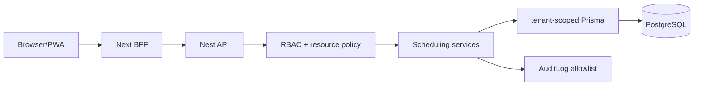

# Spec — CLI-53 Security Guardrails da Sprint 3

| Campo | Valor |
| --- | --- |
| Linear | [CLI-53](https://linear.app/clivyra/issue/CLI-53/sprint-3-security-guardrails-e-validacao-de-seguranca) — Urgent — Backlog |
| Pai esperado | CLI-68 |
| Prioridade | Gate obrigatório da Sprint 3/P0 |
| Branch | `feat/CLI-53-sprint-3-security-guardrails` |
| Depende de | CLI-22, CLI-23 e CLI-52 |
| Bloqueia | Encerramento da Sprint 3 |
| Plano | [`../PLANO_IMPLEMENTACAO.md`](../PLANO_IMPLEMENTACAO.md) |

> **Ajuste de escopo:** a descrição atual do Linear ainda inclui turmas,
> capacidade, frequência, presença e reposição. Esses itens são Sprint 6/P1.
> Este gate cobre somente agenda individual, recorrência, bloqueios,
> disponibilidade e os status da CLI-68.

## 1. Objetivo

Executar e versionar o gate de segurança da agenda P0, comprovando isolamento de
tenant, autorização por profissional, proteção contra IDOR/mass assignment,
integridade de conflito sob concorrência, limites de recorrência e ausência de
PII desnecessária em respostas, logs, auditoria, cache e artefatos.

CLI-53 revisa e reforça controles; correções de regra pertencem aos cards
CLI-22/23 e devem ser entregues neles ou em bug explícito. A sprint não fecha
com finding BLOCKER/HIGH.

## 2. Escopo

### Dentro

- threat model dos fluxos de agenda;
- testes cross-tenant e same-tenant por recurso;
- matriz de papéis;
- IDs cruzados de patient/professional/service/room/appointment/series/block;
- allowlist de DTO e mass assignment;
- máquina de estados e optimistic concurrency;
- race condition em conflito;
- limites de range, recorrência e idempotência;
- sanitização de erro;
- auditoria e logs;
- cache PWA e artefatos de E2E;
- CSRF/origin no BFF para mutações, conforme arquitetura de sessão;
- rate limiting/abuse controls quando aplicável;
- varredura de secrets/dependências e revisão manual do diff.

### Fora

- segurança de turmas, capacidade, frequência, saldo, reposição e espera;
- Google Calendar, WhatsApp/e-mail, webhooks ou OAuth;
- financeiro e clínico;
- pentest externo do ambiente de produção;
- aceitação de risco BLOCKER/HIGH pelo próprio autor.

## 3. Modelo de ameaça

### Ativos

- agenda e disponibilidade do tenant;
- identidade de paciente e profissional;
- relação pessoa↔serviço↔horário;
- integridade dos intervalos e status;
- trilha de auditoria;
- sessão autenticada.

### Atores/adversários

- usuário autenticado do tenant A tentando ler/alterar tenant B;
- PROFESSIONAL tentando administrar agenda de colega;
- usuário autorizado manipulando referências ou estados fora da UI;
- cliente concorrente tentando dupla reserva;
- cliente abusivo gerando ranges/séries excessivas;
- script/XSS tentando usar cookies/BFF ou exfiltrar dados cacheados.

### Fronteiras



Cada fronteira valida somente a responsabilidade própria. A API não confia em
botão oculto, filtro de tenant no browser ou pré-checagem de disponibilidade.

## 4. Classificação

| Severidade | Exemplos |
| --- | --- |
| BLOCKER | leitura/mutação cross-tenant; `tenantId` controlado pelo cliente; corrida permite dupla reserva; appointment de terceiro exposto por conflito |
| HIGH | PROFESSIONAL altera colega; estado terminal reaberto; bypass de conflito/status por endpoint genérico; PII em cache/log/trace acessível |
| MEDIUM | limite de range/recorrência ausente; mensagem enumera recurso interno; auditoria incompleta; throttle insuficiente |
| LOW | header/telemetria melhorável sem exploração material; hardening adicional |

BLOCKER/HIGH impedem conclusão. MEDIUM exige correção ou follow-up aceito pelo
Security Reviewer e PO antes do piloto; LOW pode virar follow-up.

## 5. Matriz de controles

| ID | Ameaça | Controle esperado | Evidência |
| --- | --- | --- | --- |
| TEN-01 | body/query `tenantId` | ValidationPipe rejeita campo | integration 400 |
| TEN-02 | appointment/series/block de B | tenant scope + 404 | integration/API E2E |
| TEN-03 | refs patient/pro/service/room de B | revalidação tenant-owned | integration 404 |
| TEN-04 | filtros forjados | tenant sempre vem da sessão | review + test |
| AUTH-01 | PROFESSIONAL altera colega | resource policy no service | 403 + inalterado |
| AUTH-02 | PROFESSIONAL cria para colega | policy valida profissional novo | 403 |
| AUTH-03 | block sala-only por PROFESSIONAL | restrito a operações/admin | 403 |
| IDOR-01 | ids válidos de outro tenant | mensagem não confirma existência | 404 genérico |
| MASS-01 | status via PATCH | campo desconhecido | 400 |
| MASS-02 | autor/version/endsAt/tenantId | allowlist e valores server-side | 400 |
| STATE-01 | reabrir terminal | state machine | 422 |
| STATE-02 | desfecho futuro | regra temporal no domínio | 422 |
| CONC-01 | dois creates mesmo profissional | lock/constraint | 1 sucesso + 1 conflito |
| CONC-02 | mesma sala/paciente | lock/constraint | 1 sucesso + 1 conflito |
| CONC-03 | block x appointment | mesma proteção | apenas 1 vence |
| CONC-04 | lost update | optimistic `version` | 409 |
| REC-01 | série sem fim/grande | data final + limites | 422 antes de persistir |
| REC-02 | retry duplica série | idempotency key tenant/ator/rota | mesma resposta |
| REC-03 | idempotency key de outro tenant | chave escopada | sem acesso/reuso |
| DOS-01 | range gigante | máximo 31 dias/500 slots | 422 |
| DOS-02 | regex/data patológica | DTO + parser limitado | 400/422 |
| PRIV-01 | conflito expõe terceiro | mapper allowlist | sem nome/id/serviço |
| PRIV-02 | profissional vê agenda alheia | projeção busy-only | teste por papel |
| PRIV-03 | logs/audit com PII | redaction + metadata allowlist | teste/captura |
| CACHE-01 | SW cacheia agenda/API | denylist autenticada | teste offline/cache |
| CSRF-01 | site externo muta BFF | SameSite + validação Origin | integration/BFF test |
| AUD-01 | mutação sem ator/trilha | `@Audited` + transação | audit por ação |

## 6. Testes automatizados obrigatórios

### 6.1 Tenant e IDOR

Para cada recurso `Appointment`, `AppointmentSeries` e `ScheduleBlock`:

1. criar em tenant B;
2. autenticar OWNER/ADMIN/RECEPTION/PROFESSIONAL de A;
3. tentar `GET`, `PATCH`, command de status/cancelamento e referência em nova
   mutação;
4. esperar `404`;
5. conferir banco: recurso de B inalterado;
6. conferir resposta/log: nenhum nome, id relacionado ou intervalo privado além
   do que o atacante já enviou.

Também cruzar individualmente `patientId`, `professionalId`, `serviceId` e
`roomId` de B em um create de A.

### 6.2 Autorização same-tenant

| Ator | Ação | Esperado |
| --- | --- | --- |
| OWNER/ADMIN/RECEPTION | CRUD operacional para profissional do tenant | permitido |
| PROFESSIONAL A | ler detalhe próprio | permitido |
| PROFESSIONAL A | criar/reagendar/status próprio | permitido |
| PROFESSIONAL A | detalhe de B | busy-only na lista; detalhe negado/projetado |
| PROFESSIONAL A | mutar appointment/série/block de B | 403 |
| PROFESSIONAL A | criar appointment com `professionalId=B` | 403 |
| PROFESSIONAL A | criar block só de sala | 403 |

Executar autorização no serviço. Teste unitário do controller não substitui
integração da policy.

### 6.3 Mass assignment

Enviar em cada DTO:

```json
{
  "tenantId": "tenant-b",
  "status": "COMPLETED",
  "endsAt": "2099-01-01T00:00:00Z",
  "createdByUserId": "user-b",
  "updatedByUserId": "user-b",
  "version": 999,
  "cancelledAt": "2099-01-01T00:00:00Z",
  "seriesId": "foreign-series"
}
```

Campos não previstos retornam `400`; campos legítimos são testados no endpoint
correto. Não remover `forbidNonWhitelisted` para aceitar payload parcial.

### 6.4 Corrida

Contra PostgreSQL real:

- 20 creates simultâneos no mesmo profissional/intervalo;
- 20 em profissionais diferentes, mesma sala;
- 20 em profissionais/salas diferentes, mesmo paciente;
- appointment e block simultâneos;
- dois reagendamentos convergindo no mesmo slot;
- série e appointment avulso cruzando uma ocorrência.

Por recurso/intervalo, exatamente uma reserva ativa pode permanecer. O teste
consulta o banco após todas as promises e repete o cenário para detectar
intermitência.

### 6.5 Recorrência/abuso

- sem `endsOn`;
- >12 meses;
- >104 ocorrências;
- weekdays vazios/duplicados/fora de 0..6;
- `intervalWeeks=0`, negativo e muito grande;
- timezone do body (deve ser rejeitado/ignorado conforme DTO);
- `Idempotency-Key` ausente, curta, gigante e repetida;
- mesma chave por tenant/ator diferente;
- range de availability >31 dias;
- retorno que ultrapassaria 500 slots.

O serviço deve rejeitar antes de alocar array/abrir transação excessiva quando
possível.

## 7. Auditoria, logs e privacidade

### 7.1 Allowlist

Auditoria pode conter:

```text
appointmentId, seriesId, scheduleBlockId,
patientId, professionalId, serviceId, roomId,
previousStartsAt, startsAt, endsAt,
previousStatus, status, cancellationCode,
occurrenceCount, resourceType, version, requestId
```

Não pode conter:

```text
patientName, cpf, phone, email, diagnosis, clinicalNotes,
request body, authorization, cookie, accessToken, refreshToken,
free-text reason, stack trace, SQL
```

### 7.2 Verificação

- testes do mapper de auditoria com payload contendo chaves proibidas;
- captura do logger em conflito/validation/500;
- consulta de `AuditLog` confirma ator/tenant/ação sem PII;
- resposta 500 genérica com `requestId`;
- traces Playwright usam fixtures sintéticas;
- nenhum `console.log` de body no módulo scheduling.

## 8. BFF, PWA e browser

- cookies de sessão mantêm flags definidas na CLI-12;
- mutações no BFF validam `Origin` e método;
- APIs de scheduling não aceitam token em query;
- CSP/headers continuam válidos nas novas rotas;
- service worker não cacheia `/app/agenda`, `/api/session` nem requests
  autenticadas para scheduling;
- browser Back/Forward Cache não deve expor agenda após logout; validar
  reautenticação/limpeza no shell;
- páginas sem permissão não recebem dados no RSC/HTML inicial;
- erro de conflito não incorpora texto não escapado de terceiros.

## 9. Rate limit e disponibilidade

Rate limiting não substitui autorização/limites de domínio.

Recomendação inicial por usuário + IP:

| Rota | Limite |
| --- | --- |
| leitura de agenda | default autenticado |
| availability | 60/min |
| criar/alterar appointment | 60/min |
| criar/alterar série | 10/min |
| criar/alterar block | 30/min |

Respostas `429` usam erro padrão e `Retry-After`, sem dados sensíveis. Ajustar
limites após métrica do piloto; não bloquear o fluxo operacional legítimo.

## 10. Revisão manual

Checklist do diff CLI-22/23:

- [ ] Todo repository tenant-owned usa contexto autenticado.
- [ ] Nenhum controller acessa Prisma.
- [ ] Nenhuma rota privada ficou `@Public()`.
- [ ] Policies cobrem recurso atual e ids novos.
- [ ] Não existe `tenantId` em DTO/query/header de domínio.
- [ ] Toda mutação de horário passa pelo mesmo conflict service.
- [ ] Não existe `delete` físico.
- [ ] Transações têm timeout/retry limitado.
- [ ] Idempotency storage é tenant/ator/rota scoped.
- [ ] Erros 404/409/422 não enumeram terceiros.
- [ ] Auditoria ocorre somente após transação bem-sucedida ou como evento de
  rejeição sanitizado.
- [ ] Índices começam por tenant e sustentam queries de conflito.
- [ ] Dependency audit não tem Critical/High introduzido.
- [ ] Sem secrets ou fixtures reais.

## 11. Evidência versionada

Criar:

```text
docs/security/sprint-3-scheduling-report.md
```

Formato:

```markdown
# Security report — Sprint 3 Scheduling
- commit/PRs revisados
- data e ambiente
- comandos executados
- matriz TEN/AUTH/IDOR/MASS/CONC/REC/PRIV/CACHE
- findings: severidade, evidência, owner, status
- riscos aceitos por responsável (somente MEDIUM/LOW)
- conclusão: PASS | FAIL
```

Não colar tokens, cookies, payloads com PII, SQL interno ou screenshots com
dados reais.

## 12. Comandos mínimos

Adaptar ao estado real do repositório:

```bash
npm run lint
npm run typecheck
npm test
npm run test:integration
npm run test:e2e
npm run check:standards
npm audit --audit-level=high
```

Também rodar a suíte focada de concorrência e tenant isolation repetidamente.
Relatar como `SKIP` qualquer comando inexistente; nunca marcar como sucesso.

## 13. Plano de execução

1. [ ] Atualizar CLI-53 no Linear para o recorte CLI-68 e vinculá-la ao pai.
2. [ ] Fixar commits/PRs CLI-22/23/52 sob revisão.
3. [ ] Criar threat model e matriz do §5 no report.
4. [ ] Revisar repositories, controllers, policies, DTOs, transações e migrations.
5. [ ] Implementar/rodar suites TEN, AUTH, IDOR, MASS, STATE e CONC.
6. [ ] Implementar/rodar suites REC, DOS, PRIV, CACHE e CSRF.
7. [ ] Rodar secret/dependency/standards checks.
8. [ ] Classificar findings e devolver correções ao card proprietário.
9. [ ] Reexecutar todos os controles após fixes.
10. [ ] Publicar report versionado sem dados sensíveis.
11. [ ] Abrir PR `CLI-53 — Security Guardrails da Sprint 3`.

## 14. Definition of Done

- [ ] Matriz do §5 possui evidência automatizada ou justificativa manual.
- [ ] Cross-tenant e resource policy passam para todos os recursos.
- [ ] Corrida não permite dupla reserva.
- [ ] Mass assignment e transições inválidas são rejeitados.
- [ ] Limites de range/recorrência/idempotência passam.
- [ ] Erros, logs, auditoria, cache e artefatos não expõem PII indevida.
- [ ] BFF/PWA não reintroduzem CSRF ou cache autenticado.
- [ ] Lint, typecheck, unit, integration, E2E, standards e audit executados.
- [ ] Report versionado identifica commits revisados.
- [ ] Zero BLOCKER/HIGH pendente.

## 15. Riscos

| Risco | Mitigação |
| --- | --- |
| Teste sequencial não detectar corrida | carga paralela repetida em PostgreSQL real |
| Guard de permissão mascarar falha da policy | testar papel autenticado com permissão geral e recurso alheio |
| Erro sanitizado, log inseguro | capturar e inspecionar ambos |
| Service worker vazar estado entre sessões | teste logout/offline/storage |
| Gate revisar escopo P1 inexistente | matriz limitada à CLI-68 |
